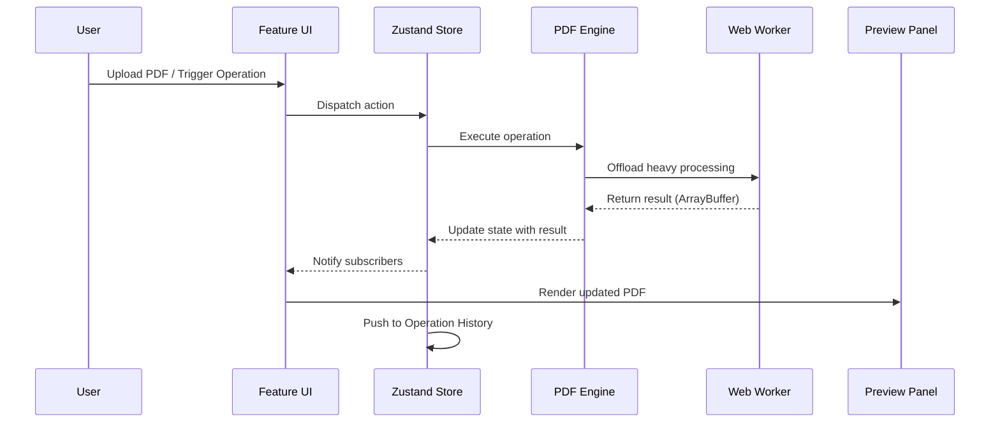
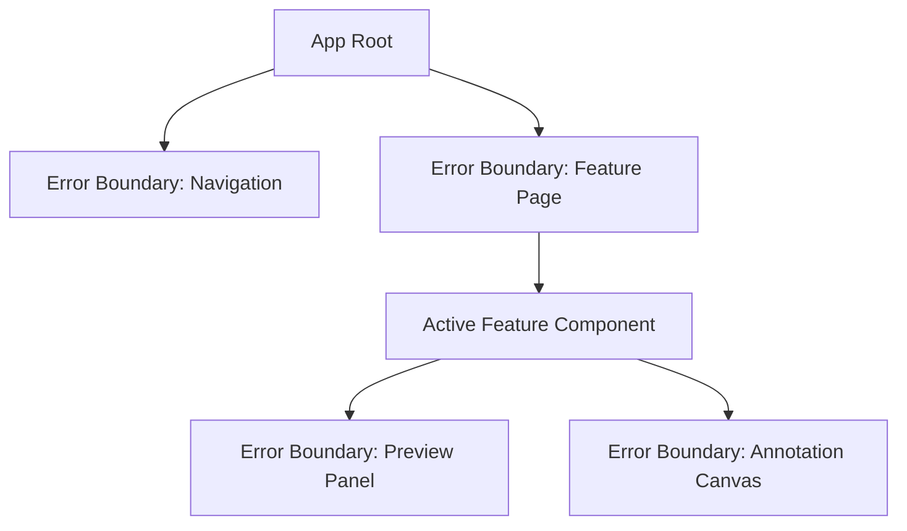

# Design Document

## Overview

This design describes the complete revamp of the existing PDF Editor application from a Create React App + Bootstrap + JavaScript codebase into a modern Vite + TypeScript + Tailwind CSS application with a feature-based architecture. The application runs entirely client-side in the browser and provides a comprehensive set of PDF operations that serve as a full replacement for desktop PDF editors like Adobe Acrobat.

The architecture is built around three core libraries:

- **pdf-lib** — for PDF creation, manipulation, and modification (merge, split, rotate, metadata, forms, encryption)
- **pdfjs-dist** (PDF.js) — for rendering PDF pages to canvas for preview, text extraction, and image extraction
- **Canvas API** — for annotations, signatures, and freehand drawing

State management uses **Zustand** for cross-cutting global state (theme, download history, operation history) and local React state/hooks for feature-specific concerns. This provides a lightweight, performant approach without the boilerplate of Redux while avoiding the re-render issues of React Context for frequently-changing state.

Key design decisions:

- **Dual PDF library approach**: pdf-lib handles structural PDF manipulation while pdfjs-dist handles rendering and content extraction. These complement each other — pdf-lib cannot render pages, and pdfjs-dist cannot modify PDF structure.
- **Web Workers**: Heavy PDF operations run in Web Workers to keep the UI responsive.
- **Feature isolation**: Each PDF operation is a self-contained feature directory with its own components, hooks, and utilities.
- **Command pattern for undo/redo**: Operations are modeled as reversible commands stored in a history stack.

## Architecture

### High-Level Architecture

```mermaid
graph TB
    subgraph Browser
        subgraph UI Layer
            Nav[Navigation Bar]
            Theme[Theme Provider]
            Toast[Toast System]
            Progress[Progress Indicator]
        end

        subgraph Feature Layer
            Merge[Merge Feature]
            Split[Split Feature]
            Rotate[Rotate Feature]
            Delete[Delete Pages]
            Reorder[Reorder Pages]
            Compress[Compress]
            ImgToPdf[Image to PDF]
            PageNums[Page Numbers]
            ExtractImg[Extract Images]
            TextOverlay[Text Overlay]
            Highlight[Highlight]
            Signature[Signature]
            Stamps[Stamps]
            Watermarks[Watermarks]
            Password[Password Protect]
            Unlock[Unlock PDF]
            Redact[Redact]
            Metadata[Metadata]
            FormFill[Form Fill]
            Compare[Compare/Diff]
            ExtractText[Extract Text]
            PdfToImg[PDF to Image]
            Flatten[Flatten]
            Crop[Crop]
            Headers[Headers/Footers]
            Bookmarks[Bookmarks]
            PageSize[Page Size]
            Linearize[Linearize]
            Duplicate[Duplicate Pages]
        end

        subgraph Core Layer
            PDFEngine[PDF Engine - pdf-lib]
            RenderEngine[Render Engine - pdfjs-dist]
            AnnotationEngine[Annotation Engine - Canvas]
            SecurityModule[Security Module]
            BatchProcessor[Batch Processor]
        end

        subgraph State Layer
            ZustandStore[Zustand Store]
            OpHistory[Operation History]
            DownloadHistory[Download History]
            ThemeState[Theme State]
        end

        subgraph Worker Layer
            PDFWorker[PDF Worker Thread]
        end
    end

    UI Layer --> Feature Layer
    Feature Layer --> Core Layer
    Feature Layer --> State Layer
    Core Layer --> Worker Layer
    Core Layer --> State Layer
```

### Project Structure

```
src/
├── app/
│   ├── App.tsx
│   ├── router.tsx
│   └── providers.tsx
├── components/
│   └── ui/
│       ├── Button.tsx
│       ├── Modal.tsx
│       ├── Input.tsx
│       ├── Toast.tsx
│       ├── ProgressBar.tsx
│       ├── FileUploadZone.tsx
│       ├── Skeleton.tsx
│       └── ErrorBoundary.tsx
├── features/
│   ├── merge/
│   │   ├── components/
│   │   ├── hooks/
│   │   └── utils/
│   ├── split/
│   ├── rotate/
│   ├── delete-pages/
│   ├── reorder/
│   ├── compress/
│   ├── image-to-pdf/
│   ├── page-numbers/
│   ├── extract-images/
│   ├── text-overlay/
│   ├── highlight/
│   ├── signature/
│   ├── stamps/
│   ├── watermarks/
│   ├── password-protect/
│   ├── unlock/
│   ├── redact/
│   ├── metadata/
│   ├── form-fill/
│   ├── compare/
│   ├── extract-text/
│   ├── pdf-to-image/
│   ├── flatten/
│   ├── crop/
│   ├── headers-footers/
│   ├── bookmarks/
│   ├── page-size/
│   ├── linearize/
│   └── duplicate-pages/
├── core/
│   ├── pdf-engine/
│   │   ├── index.ts
│   │   ├── operations.ts
│   │   └── worker.ts
│   ├── render-engine/
│   │   ├── index.ts
│   │   └── renderer.ts
│   ├── annotation-engine/
│   │   ├── index.ts
│   │   ├── canvas-manager.ts
│   │   └── tools.ts
│   ├── security/
│   │   ├── index.ts
│   │   ├── encrypt.ts
│   │   └── redact.ts
│   └── batch/
│       └── processor.ts
├── store/
│   ├── index.ts
│   ├── theme.ts
│   ├── history.ts
│   └── downloads.ts
├── hooks/
│   ├── useFileUpload.ts
│   ├── usePdfPreview.ts
│   ├── useUndoRedo.ts
│   └── useToast.ts
├── types/
│   ├── pdf.ts
│   ├── operations.ts
│   ├── annotations.ts
│   └── common.ts
├── workers/
│   └── pdf.worker.ts
└── utils/
    ├── file-size.ts
    ├── validation.ts
    └── format.ts
```

### Data Flow



## Components and Interfaces

### Core Engine Interfaces

```typescript
// src/types/pdf.ts

export interface PdfDocument {
  id: string;
  name: string;
  data: ArrayBuffer;
  pageCount: number;
  fileSize: number;
  metadata: PdfMetadata;
  isEncrypted: boolean;
  isLinearized: boolean;
}

export interface PdfMetadata {
  title: string | null;
  author: string | null;
  subject: string | null;
  keywords: string[];
  creationDate: Date | null;
  modificationDate: Date | null;
}

export interface PdfPage {
  pageNumber: number;
  width: number;
  height: number;
  rotation: number;
}

export interface OperationResult {
  success: boolean;
  data?: ArrayBuffer;
  error?: string;
  metadata?: Record<string, unknown>;
}
```

### PDF Engine Interface

```typescript
// src/core/pdf-engine/index.ts

export interface IPdfEngine {
  // Document operations
  load(data: ArrayBuffer, password?: string): Promise<PdfDocument>;
  save(doc: PdfDocument): Promise<ArrayBuffer>;

  // Page operations
  rotatePages(data: ArrayBuffer, pages: number[], angle: 90 | 180 | 270): Promise<OperationResult>;
  deletePages(data: ArrayBuffer, pages: number[]): Promise<OperationResult>;
  reorderPages(data: ArrayBuffer, newOrder: number[]): Promise<OperationResult>;
  duplicatePages(data: ArrayBuffer, pages: number[], copies: number): Promise<OperationResult>;
  splitByRanges(data: ArrayBuffer, ranges: PageRange[]): Promise<OperationResult[]>;
  merge(documents: ArrayBuffer[]): Promise<OperationResult>;

  // Content operations
  addPageNumbers(data: ArrayBuffer, config: PageNumberConfig): Promise<OperationResult>;
  addHeadersFooters(data: ArrayBuffer, config: HeaderFooterConfig): Promise<OperationResult>;
  addWatermark(data: ArrayBuffer, config: WatermarkConfig): Promise<OperationResult>;
  addTextOverlay(data: ArrayBuffer, overlays: TextOverlay[]): Promise<OperationResult>;
  embedAnnotation(data: ArrayBuffer, annotation: AnnotationData): Promise<OperationResult>;

  // Conversion operations
  imagesToPdf(images: ImageFile[]): Promise<OperationResult>;
  compress(data: ArrayBuffer): Promise<OperationResult>;
  flatten(data: ArrayBuffer): Promise<OperationResult>;
  cropPages(data: ArrayBuffer, pages: number[], cropBox: CropBox): Promise<OperationResult>;
  resizePages(data: ArrayBuffer, pages: number[], size: PageSize): Promise<OperationResult>;
  linearize(data: ArrayBuffer): Promise<OperationResult>;

  // Metadata and structure
  getMetadata(data: ArrayBuffer): Promise<PdfMetadata>;
  setMetadata(data: ArrayBuffer, metadata: Partial<PdfMetadata>): Promise<OperationResult>;
  getBookmarks(data: ArrayBuffer): Promise<Bookmark[]>;
  setBookmarks(data: ArrayBuffer, bookmarks: Bookmark[]): Promise<OperationResult>;
  getFormFields(data: ArrayBuffer): Promise<FormField[]>;
  fillFormFields(
    data: ArrayBuffer,
    values: Record<string, string | boolean>,
  ): Promise<OperationResult>;

  // Security
  encrypt(data: ArrayBuffer, password: string): Promise<OperationResult>;
  decrypt(data: ArrayBuffer, password: string): Promise<OperationResult>;
  redact(data: ArrayBuffer, regions: RedactRegion[]): Promise<OperationResult>;
}
```

### Render Engine Interface

```typescript
// src/core/render-engine/index.ts

export interface IRenderEngine {
  loadDocument(data: ArrayBuffer): Promise<RenderableDocument>;
  renderPage(doc: RenderableDocument, pageNum: number, scale: number): Promise<HTMLCanvasElement>;
  renderThumbnail(
    doc: RenderableDocument,
    pageNum: number,
    width: number,
  ): Promise<HTMLCanvasElement>;
  extractText(doc: RenderableDocument, pageNum?: number): Promise<string>;
  extractImages(doc: RenderableDocument): Promise<ExtractedImage[]>;
  getPageCount(doc: RenderableDocument): number;
  comparePages(
    doc1: RenderableDocument,
    doc2: RenderableDocument,
    pageNum: number,
  ): Promise<boolean>;
}

export interface RenderableDocument {
  id: string;
  pageCount: number;
  getPage(num: number): Promise<RenderablePage>;
}

export interface RenderablePage {
  width: number;
  height: number;
  render(canvas: HTMLCanvasElement, scale: number): Promise<void>;
}
```

### Annotation Engine Interface

```typescript
// src/core/annotation-engine/index.ts

export interface IAnnotationEngine {
  initCanvas(container: HTMLElement, page: PdfPage): AnnotationCanvas;
  setTool(canvas: AnnotationCanvas, tool: AnnotationTool): void;
  addHighlight(canvas: AnnotationCanvas, rect: Rect, color: string, opacity: number): AnnotationId;
  addSignature(canvas: AnnotationCanvas, strokes: Stroke[], position: Point): AnnotationId;
  addStamp(canvas: AnnotationCanvas, stamp: StampType, position: Point, size: Size): AnnotationId;
  addTextOverlay(
    canvas: AnnotationCanvas,
    text: string,
    position: Point,
    style: TextStyle,
  ): AnnotationId;
  removeAnnotation(canvas: AnnotationCanvas, id: AnnotationId): void;
  getAnnotations(canvas: AnnotationCanvas): AnnotationData[];
  clear(canvas: AnnotationCanvas): void;
}

export type AnnotationTool = 'highlight' | 'signature' | 'stamp' | 'text' | 'redact';

export interface Stroke {
  points: Point[];
  color: string;
  width: number;
}

export interface TextStyle {
  fontSize: number;
  color: string;
  fontFamily: string;
}
```

### State Store Interface

```typescript
// src/store/index.ts

export interface AppState {
  // Theme
  theme: 'light' | 'dark';
  toggleTheme: () => void;

  // Operation History (Undo/Redo)
  undoStack: Operation[];
  redoStack: Operation[];
  pushOperation: (op: Operation) => void;
  undo: () => Operation | undefined;
  redo: () => Operation | undefined;
  canUndo: boolean;
  canRedo: boolean;

  // Download History
  downloads: DownloadEntry[];
  addDownload: (entry: DownloadEntry) => void;
  clearDownloads: () => void;
}

export interface Operation {
  id: string;
  type: string;
  timestamp: number;
  previousState: ArrayBuffer;
  currentState: ArrayBuffer;
  description: string;
}

export interface DownloadEntry {
  id: string;
  fileName: string;
  operation: string;
  timestamp: number;
  fileData: ArrayBuffer;
  fileSize: number;
}
```

### Shared UI Component Props

```typescript
// src/components/ui/types.ts

export interface FileUploadZoneProps {
  accept: string[];
  maxFileSize: number; // bytes
  maxFiles: number;
  onFilesAccepted: (files: File[]) => void;
  onFileRejected: (file: File, reason: string) => void;
  multiple?: boolean;
}

export interface ToastProps {
  id: string;
  message: string;
  severity: 'success' | 'warning' | 'error';
  duration?: number; // ms, default 5000
  onDismiss: (id: string) => void;
}

export interface ProgressBarProps {
  progress: number | null; // null = indeterminate
  label: string;
  ariaLabel: string;
}

export interface PreviewPanelProps {
  originalDoc: ArrayBuffer | null;
  modifiedDoc: ArrayBuffer | null;
  zoom: number;
  onZoomChange: (zoom: number) => void;
  currentPage: number;
  onPageChange: (page: number) => void;
}
```

## Data Models

### File Size Formatting

```typescript
// src/utils/file-size.ts

export interface FileSizeDisplay {
  original: string; // e.g., "2.4 MB"
  modified: string; // e.g., "1.8 MB"
  percentChange: string; // e.g., "−25.0%"
}

export function formatFileSize(bytes: number): string {
  if (bytes < 1024) return `${bytes} bytes`;
  if (bytes < 1024 * 1024) return `${(bytes / 1024).toFixed(1)} KB`;
  return `${(bytes / (1024 * 1024)).toFixed(1)} MB`;
}

export function calculatePercentChange(original: number, modified: number): string {
  if (original === modified) return '0.0%';
  const change = ((modified - original) / original) * 100;
  const prefix = change > 0 ? '+' : '−';
  return `${prefix}${Math.abs(change).toFixed(1)}%`;
}
```

### Page Range Parsing

```typescript
// src/types/operations.ts

export interface PageRange {
  start: number;
  end: number;
}

export interface PageNumberConfig {
  position:
    | 'top-left'
    | 'top-center'
    | 'top-right'
    | 'bottom-left'
    | 'bottom-center'
    | 'bottom-right';
  startNumber: number;
  fontSize?: number;
  color?: string;
}

export interface HeaderFooterConfig {
  header: { left: string; center: string; right: string };
  footer: { left: string; center: string; right: string };
  fontSize: number;
  margin: number;
}

export interface WatermarkConfig {
  type: 'text' | 'image';
  text?: string;
  imageData?: ArrayBuffer;
  opacity: number;
  rotation: number;
}

export interface CropBox {
  x: number;
  y: number;
  width: number;
  height: number;
}

export interface PageSize {
  width: number; // mm
  height: number; // mm
  orientation: 'portrait' | 'landscape';
}

export type StampType = 'APPROVED' | 'DRAFT' | 'CONFIDENTIAL';
```

### Bookmark Tree

```typescript
// src/types/pdf.ts

export interface Bookmark {
  id: string;
  title: string;
  pageNumber: number;
  children: Bookmark[];
}
```

### Form Fields

```typescript
// src/types/pdf.ts

export interface FormField {
  name: string;
  type: 'text' | 'checkbox' | 'dropdown' | 'radio';
  value: string | boolean;
  options?: string[]; // for dropdown/radio
  page: number;
  rect: Rect;
}
```

### Batch Processing

```typescript
// src/core/batch/processor.ts

export interface BatchJob {
  id: string;
  files: File[];
  operation: string;
  config: Record<string, unknown>;
  status: 'pending' | 'processing' | 'completed' | 'cancelled';
  results: BatchResult[];
  currentIndex: number;
}

export interface BatchResult {
  fileName: string;
  success: boolean;
  data?: ArrayBuffer;
  fileSize?: number;
  error?: string;
}
```

### Comparison/Diff

```typescript
// src/features/compare/types.ts

export interface ComparisonResult {
  pagesAdded: number;
  pagesRemoved: number;
  pagesChanged: number;
  differences: PageDifference[];
}

export interface PageDifference {
  pageNumber: number;
  type: 'added' | 'removed' | 'changed';
}
```

## Correctness Properties

_A property is a characteristic or behavior that should hold true across all valid executions of a system — essentially, a formal statement about what the system should do. Properties serve as the bridge between human-readable specifications and machine-verifiable correctness guarantees._

### Property 1: Rotation preserves page count and applies correct angle

_For any_ valid PDF with N pages, any non-empty subset of pages, and any rotation angle in {90, 180, 270}, rotating the selected pages SHALL produce a valid PDF with N pages where each selected page's rotation is increased by the specified angle (mod 360).

**Validates: Requirements 6.1**

### Property 2: Page deletion reduces page count by exactly the number of deleted pages

_For any_ valid PDF with N pages (N ≥ 2) and any non-empty proper subset S of pages (|S| < N), deleting pages in S SHALL produce a valid PDF with exactly N − |S| pages.

**Validates: Requirements 7.1**

### Property 3: Page reordering preserves all pages in specified sequence

_For any_ valid PDF with N pages and any permutation P of [1..N], reordering pages according to P SHALL produce a valid PDF with N pages where the page at position i has the content of the original page at position P[i].

**Validates: Requirements 8.4**

### Property 4: Compression produces valid PDF with same page count

_For any_ valid PDF with N pages, compressing it SHALL produce a valid PDF with exactly N pages (content integrity preserved regardless of whether file size decreased).

**Validates: Requirements 9.1**

### Property 5: Image-to-PDF conversion produces one page per image in order

_For any_ set of 1 to 50 valid PNG or JPG images, converting them to PDF SHALL produce a valid PDF with exactly as many pages as images, in the same order as specified.

**Validates: Requirements 10.1**

### Property 6: Image aspect ratio preservation

_For any_ image with width W and height H embedded in a PDF page, the ratio of the embedded image's width to height SHALL equal W/H (within floating-point tolerance).

**Validates: Requirements 10.2**

### Property 7: Sequential page numbering from starting number

_For any_ valid PDF with N pages and any starting number S in [1, 9999], adding page numbers SHALL embed numbers S, S+1, ..., S+N−1 on the respective pages.

**Validates: Requirements 11.1, 11.3**

### Property 8: Encrypt/decrypt round-trip preserves PDF content

_For any_ valid PDF and any password string of length 1 to 128, encrypting the PDF with the password and then decrypting with the same password SHALL produce a PDF with identical page count and content to the original.

**Validates: Requirements 18.1, 19.1**

### Property 9: Incorrect password rejection

_For any_ encrypted PDF and any password that differs from the encryption password, attempting decryption SHALL fail with an appropriate error (never silently produce corrupted output).

**Validates: Requirements 19.2**

### Property 10: File type validation rejects unsupported types

_For any_ file with a MIME type not in the accepted set {application/pdf, image/png, image/jpeg}, the file validation logic SHALL reject the file and identify the unsupported type.

**Validates: Requirements 21.4, 6.3, 7.4, 8.6, 9.5**

### Property 11: File size validation rejects files exceeding maximum

_For any_ file with size greater than the configured maximum (100 MB for upload, 50 MB per file for merge), the size validation logic SHALL reject the file.

**Validates: Requirements 21.5, 44.6**

### Property 12: Download history bounded FIFO queue

_For any_ sequence of download entries added to the Session_Download_History, the history length SHALL never exceed 50, and when at capacity, adding a new entry SHALL remove the oldest entry (FIFO order preserved).

**Validates: Requirements 24.1, 24.6**

### Property 13: Undo stack bounded size invariant

_For any_ sequence of operations pushed to the undo stack, the stack size SHALL never exceed 50 entries, discarding the oldest when the limit is reached.

**Validates: Requirements 25.1**

### Property 14: Undo/redo round-trip restores state

_For any_ sequence of operations followed by an undo, the document state SHALL equal the state before the last operation. Furthermore, performing a redo after an undo SHALL restore the document to the state after the operation.

**Validates: Requirements 25.2, 25.3**

### Property 15: New operation after undo clears redo stack

_For any_ state where the redo stack is non-empty (due to previous undos), performing a new operation SHALL clear the redo stack entirely.

**Validates: Requirements 25.5**

### Property 16: Theme persistence round-trip

_For any_ theme value in {'light', 'dark'}, setting the theme and then reading from local storage SHALL return the same theme value.

**Validates: Requirements 26.3, 26.4**

### Property 17: File size formatting correctness

_For any_ non-negative integer byte count, the formatting function SHALL return: bytes (literal count) for values < 1024, KB with one decimal for values in [1024, 1048576), and MB with one decimal for values ≥ 1048576.

**Validates: Requirements 29.1**

### Property 18: Percentage change calculation correctness

_For any_ two positive file sizes (original, modified), the percentage change SHALL equal ((modified − original) / original) × 100, rounded to one decimal place, prefixed with "+" for increases and "−" for decreases, and "0.0%" when equal.

**Validates: Requirements 29.3, 29.4**

### Property 19: Merge produces PDF with sum of all page counts

_For any_ set of 2 to 20 valid PDFs with page counts P1, P2, ..., Pn, merging them SHALL produce a single valid PDF with exactly P1 + P2 + ... + Pn pages.

**Validates: Requirements 44.1**

### Property 20: Split produces PDFs with correct page counts per range

_For any_ valid PDF with N pages and any set of valid page ranges, splitting SHALL produce one PDF per range where each output has exactly (end − start + 1) pages.

**Validates: Requirements 45.1**

### Property 21: Page range validation rejects invalid ranges

_For any_ page range where start > end, start < 1, end > total pages, or contains non-numeric input, the validation logic SHALL reject the range with an appropriate error message.

**Validates: Requirements 45.4**

### Property 22: Page duplication increases page count correctly

_For any_ valid PDF with N pages, any non-empty subset S of pages, and any copy count C in [1, 10], duplicating SHALL produce a PDF with exactly N + (|S| × C) pages, provided the result does not exceed 500 pages.

**Validates: Requirements 48.1, 48.2**

### Property 23: Duplication rejects operations exceeding 500 pages

_For any_ duplication operation where the resulting page count would exceed 500, the operation SHALL be rejected without modifying the PDF.

**Validates: Requirements 48.6**

### Property 24: Page resize applies target dimensions

_For any_ valid PDF page and any target dimensions within [25mm, 3000mm] for both width and height, resizing SHALL produce a page with the specified target dimensions.

**Validates: Requirements 46.3**

### Property 25: Dimension validation rejects out-of-range values

_For any_ custom page dimension value below 25mm or above 3000mm, the validation logic SHALL reject the input.

**Validates: Requirements 46.7**

### Property 26: Crop region validation rejects invalid regions

_For any_ crop region that extends beyond page boundaries or has zero area (width ≤ 0 or height ≤ 0), the validation logic SHALL reject the region.

**Validates: Requirements 41.6**

### Property 27: Header/footer placeholder resolution

_For any_ header or footer template containing placeholders ({page}, {total}, {date}), rendering the template for page P of a PDF with T total pages SHALL replace {page} with P, {total} with T, and {date} with the current date in YYYY-MM-DD format, with no unresolved placeholders remaining.

**Validates: Requirements 42.2, 42.3**

### Property 28: Bookmark title validation

_For any_ bookmark title string, the validation logic SHALL accept strings with length in [1, 200] and reject empty strings or strings exceeding 200 characters.

**Validates: Requirements 43.5**

### Property 29: Flatten removes all interactive form fields

_For any_ valid PDF containing form fields, flattening SHALL produce a PDF where no form fields are detectable (form field count equals zero).

**Validates: Requirements 40.4**

### Property 30: Batch processing resilience

_For any_ batch of files where some are valid and some are invalid, the batch processor SHALL successfully process all valid files and report failures only for invalid files, without stopping the entire batch.

**Validates: Requirements 22.4**

### Property 31: Redacted content is irrecoverable

_For any_ valid PDF with known text content in a specified region, after redaction of that region, the output PDF byte stream SHALL NOT contain the original text bytes from the redacted area.

**Validates: Requirements 20.3**

### Property 32: Password validation rejects empty and oversized passwords

_For any_ password string, the validation logic SHALL accept strings with length in [1, 128] and reject empty strings or strings exceeding 128 characters.

**Validates: Requirements 18.5**

### Property 33: Metadata field validation

_For any_ metadata field value, the validation logic SHALL accept title/author/subject strings up to 255 characters, keywords up to 20 entries each up to 100 characters, and reject values exceeding these limits.

**Validates: Requirements 35.2**

### Property 34: Comparison diff summary consistency

_For any_ two valid PDFs with page counts A and B, the comparison summary SHALL satisfy: pagesChanged + pagesUnchanged = min(A, B), pagesAdded = max(0, B − A), and pagesRemoved = max(0, A − B).

**Validates: Requirements 37.3**

## Error Handling

### Error Boundary Strategy

The application uses React Error Boundaries at the feature level to prevent a crash in one feature from taking down the entire application.



**Error Boundary Hierarchy:**

1. **App-level boundary** — catches catastrophic errors, shows full-page fallback with reload option
2. **Feature-level boundary** — wraps each feature route, shows feature-specific fallback with retry button
3. **Component-level boundary** — wraps Preview Panel and Annotation Canvas, shows placeholder with error context

### Toast Notification System

All user-facing errors are communicated through a centralized toast notification system:

```typescript
interface ToastConfig {
  severity: 'success' | 'warning' | 'error';
  message: string;
  duration: number; // default 5000ms
  dismissible: boolean;
  ariaLive: 'polite' | 'assertive';
}
```

**Severity mapping:**

- **Error** (red, error icon): Operation failures, invalid files, security errors
- **Warning** (amber, warning icon): Validation issues, size limits, no-op results (e.g., file already linearized)
- **Success** (green, check icon): Operation completed, file ready for download

**Behavior:**

- Auto-dismiss after 5 seconds unless hovered or clicked
- Manual dismiss button always visible
- Stacks vertically (max 3 visible, older ones queued)
- Accessible via `aria-live="assertive"` for errors, `aria-live="polite"` for success/warning

### Error Categories and Handling

| Category          | Example                            | Handling                                                    |
| ----------------- | ---------------------------------- | ----------------------------------------------------------- |
| Invalid file type | User drops a .docx file            | Toast error, file rejected, upload zone remains active      |
| File too large    | File exceeds 100 MB                | Toast error with size limit info, file rejected             |
| Invalid PDF       | Corrupted or malformed PDF         | Toast error, operation cancelled, user input preserved      |
| Operation failure | pdf-lib throws during processing   | Toast error with retry suggestion, previous state preserved |
| Validation error  | Empty password, invalid page range | Toast warning, form field highlighted, user can correct     |
| Worker crash      | Web Worker throws unhandled error  | Toast error, worker restarted, user can retry               |
| Render failure    | pdfjs-dist cannot render a page    | Placeholder shown for that page, other pages still render   |

### Input Preservation

When an error occurs during an operation, the application preserves:

- All uploaded files (kept in memory)
- All user-entered configuration (form values, selections)
- Current page/zoom state in the preview panel
- Operation history (undo/redo stacks)

The user can correct the issue and retry without re-uploading or re-entering data.

## Testing Strategy

### Test Framework and Tools

- **Test Runner**: Vitest (native Vite integration, fast execution, TypeScript support)
- **Component Testing**: React Testing Library + jsdom
- **Property-Based Testing**: fast-check (with `@fast-check/vitest` integration)
- **E2E Testing**: Playwright (for critical user flows)

### Test Structure

```
test/
├── unit/
│   ├── core/
│   │   ├── pdf-engine.test.ts
│   │   ├── render-engine.test.ts
│   │   ├── annotation-engine.test.ts
│   │   └── security.test.ts
│   ├── store/
│   │   ├── history.test.ts
│   │   ├── downloads.test.ts
│   │   └── theme.test.ts
│   └── utils/
│       ├── file-size.test.ts
│       ├── validation.test.ts
│       └── format.test.ts
├── property/
│   ├── pdf-operations.property.test.ts
│   ├── validation.property.test.ts
│   ├── history.property.test.ts
│   └── formatting.property.test.ts
├── integration/
│   ├── merge-flow.test.ts
│   ├── split-flow.test.ts
│   ├── encrypt-decrypt.test.ts
│   └── batch-processing.test.ts
├── e2e/
│   ├── upload-and-process.spec.ts
│   ├── drag-and-drop.spec.ts
│   └── undo-redo.spec.ts
└── fixtures/
    ├── sample-1page.pdf
    ├── sample-5pages.pdf
    ├── sample-encrypted.pdf
    ├── sample-with-forms.pdf
    └── sample-image.png
```

### Property-Based Testing Configuration

- **Library**: fast-check
- **Minimum iterations**: 100 per property test
- **Tag format**: `Feature: pdf-editor-revamp, Property {number}: {property_text}`

Each correctness property from the design document maps to exactly one property-based test. Property tests focus on:

- Pure utility functions (file size formatting, percentage calculation, validation)
- State management logic (undo/redo stack, download history queue)
- PDF operation invariants (page count after merge/split/delete/duplicate)
- Round-trip properties (encrypt/decrypt, theme persistence)
- Input validation boundaries (password length, page ranges, dimensions)

### Unit Testing Focus

Unit tests complement property tests by covering:

- Specific examples that demonstrate correct behavior (e.g., merging two known PDFs)
- Integration points between components (e.g., PDF engine + render engine)
- Edge cases identified in prework (e.g., deleting all pages, empty PDF)
- UI component behavior (e.g., toast auto-dismiss, progress bar states)
- Error boundary fallback rendering

### Integration Testing Focus

Integration tests verify:

- End-to-end feature flows (upload → process → preview → download)
- Web Worker communication (main thread ↔ worker message passing)
- PDF rendering with pdfjs-dist (known PDFs render correctly)
- Form field detection and filling with real PDF fixtures
- Text extraction accuracy with known content

### Test Coverage Goals

- **Core utilities and validation**: 95%+ (property + unit tests)
- **State management**: 90%+ (property tests for invariants)
- **PDF operations**: 85%+ (property tests for invariants, integration tests for correctness)
- **UI components**: 80%+ (React Testing Library)
- **E2E critical paths**: Top 5 user flows covered
