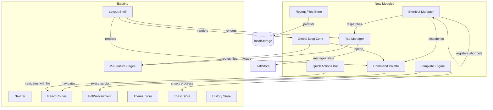
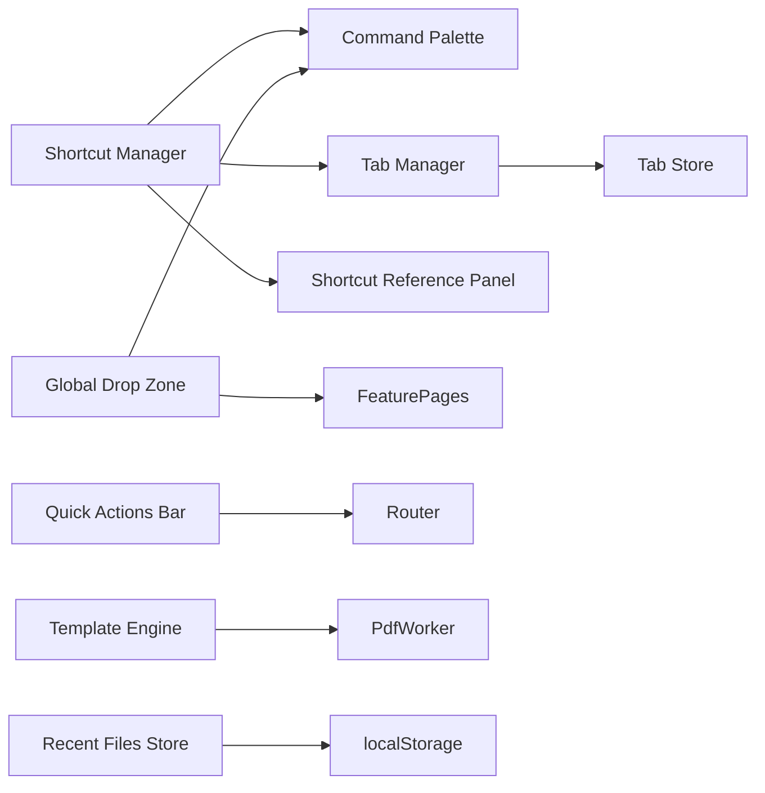

# Design Document: UX Power User Features

## Overview

This design introduces a suite of power-user productivity features to the existing PDF Editor application. The features are organized into seven interconnected modules that integrate with the existing Vite + TypeScript + React + Tailwind CSS + Zustand architecture:

1. **Command Palette** — Keyboard-driven searchable overlay for navigating to any operation
2. **Shortcut Manager** — Global keyboard shortcut registration, resolution, and dispatch
3. **Tab Manager** — Multi-document tabbed interface with independent operation state
4. **Recent Files Store** — localStorage-backed history of recently opened files
5. **Template Engine** — Sequential multi-operation workflow execution
6. **Global Drop Zone** — Application-wide drag-and-drop file handling
7. **Quick Actions Bar** — Contextual follow-up operation suggestions

These modules are designed as independent Zustand stores and React components that compose with the existing `Layout`, `NavBar`, and feature page architecture without modifying existing operation implementations.

## Architecture

### System Integration Diagram



### Module Dependency Graph



### Integration Points

- **Layout.tsx**: Wraps children with `<GlobalDropZone>` and renders `<CommandPalette>` and `<ShortcutReferencePanel>` as portals
- **App.tsx**: Registers the `ShortcutManager` provider at the top level
- **Router**: Tab Manager sits between the router outlet and feature pages, managing which tab's content is displayed
- **Feature Pages**: Unchanged — Tab Manager wraps them and manages their file/state context
- **PdfWorkerClient**: Template Engine calls existing worker operations sequentially

## Components and Interfaces

### 1. Command Palette

```typescript
// src/features/command-palette/types.ts
export interface CommandItem {
  id: string;
  name: string;
  description: string;
  route: string;
  keywords: string[];
  category: 'operation' | 'navigation' | 'action';
  icon?: string;
}

export interface CommandPaletteState {
  isOpen: boolean;
  query: string;
  activeIndex: number;
  items: CommandItem[];
  filteredItems: CommandItem[];
  previousFocusElement: HTMLElement | null;
  open: () => void;
  close: () => void;
  setQuery: (query: string) => void;
  moveSelection: (direction: 'up' | 'down') => void;
  getActiveItem: () => CommandItem | null;
}
```

```typescript
// src/features/command-palette/filter.ts
/**
 * Filters command items by checking that every space-separated token
 * in the query appears as a case-insensitive substring in the item's
 * name or description.
 */
export function filterCommands(items: CommandItem[], query: string): CommandItem[];
```

**Component**: `<CommandPalette />` — Modal overlay with search input and scrollable results list. Renders via React portal to `document.body`.

### 2. Shortcut Manager

```typescript
// src/features/shortcuts/types.ts
export type ShortcutScope = 'global' | 'panel' | 'modal';
export type ShortcutCategory = 'navigation' | 'operations' | 'application';

export interface ShortcutBinding {
  id: string;
  keys: ShortcutKeys;
  action: () => void;
  label: string;
  category: ShortcutCategory;
  scope: ShortcutScope;
  /** If true, fires even when text input is focused */
  bypassInputFocus: boolean;
}

export interface ShortcutKeys {
  key: string;
  ctrl?: boolean;
  meta?: boolean;
  shift?: boolean;
  alt?: boolean;
}

export interface ShortcutManagerState {
  bindings: Map<string, ShortcutBinding>;
  register: (binding: ShortcutBinding) => void;
  unregister: (id: string) => void;
  resolve: (event: KeyboardEvent, focusContext: FocusContext) => ShortcutBinding | null;
  getAll: () => ShortcutBinding[];
  getByCategory: (category: ShortcutCategory) => ShortcutBinding[];
}

export interface FocusContext {
  isTextInput: boolean;
  activeScope: ShortcutScope;
}
```

```typescript
// src/features/shortcuts/format.ts
export type Platform = 'mac' | 'windows' | 'linux';

/**
 * Formats a ShortcutKeys object into a human-readable string
 * appropriate for the current OS (e.g., "⌘K" on mac, "Ctrl+K" on windows).
 */
export function formatShortcut(keys: ShortcutKeys, platform: Platform): string;

/**
 * Detects the current platform from navigator.userAgent.
 */
export function detectPlatform(): Platform;
```

**Component**: `<ShortcutProvider />` — Context provider that attaches a global `keydown` listener to `document` and dispatches to the store's `resolve` method.

**Component**: `<ShortcutReferencePanel />` — Modal overlay listing all shortcuts grouped by category with search filtering.

### 3. Tab Manager

```typescript
// src/features/tabs/types.ts
export interface DocumentTab {
  id: string;
  fileName: string;
  fileData: ArrayBuffer;
  fileSize: number;
  operationRoute: string;
  operationState: Record<string, unknown>;
  createdAt: number;
}

export interface TabManagerState {
  tabs: DocumentTab[];
  activeTabId: string | null;
  clipboard: ClipboardData | null;
  maxTabs: number; // 10

  // Tab lifecycle
  openTab: (file: File, operationRoute: string) => boolean;
  closeTab: (tabId: string) => void;
  switchTab: (tabId: string) => void;
  cycleTab: (direction: 'next' | 'prev') => void;

  // Tab state
  updateTabState: (tabId: string, state: Record<string, unknown>) => void;
  getActiveTab: () => DocumentTab | null;

  // Clipboard
  copyPages: (pages: PageData[]) => void;
  pastePages: (targetTabId: string, afterPageIndex: number | null) => void;
}

export interface PageData {
  index: number;
  data: ArrayBuffer;
  width: number;
  height: number;
}

export interface ClipboardData {
  pages: PageData[];
  sourceTabId: string;
  copiedAt: number;
}
```

**Component**: `<TabBar />` — Horizontal tab strip rendered above the main content area inside `Layout`. Supports horizontal scrolling when tabs overflow.

**Component**: `<TabContent />` — Wrapper that renders the active tab's feature page with its preserved state.

### 4. Recent Files Store

```typescript
// src/features/recent-files/types.ts
export interface RecentFileEntry {
  id: string;
  fileName: string;
  fileSize: number;
  lastOpenedAt: number;
  operationRoute: string;
  operationName: string;
}

export interface RecentFilesState {
  entries: RecentFileEntry[];
  maxEntries: number; // 20

  addEntry: (file: File, operationRoute: string, operationName: string) => void;
  removeEntry: (id: string) => void;
  clearAll: () => void;
  getEntries: () => RecentFileEntry[];
}
```

```typescript
// src/features/recent-files/storage.ts
const STORAGE_KEY = 'pdf-editor-recent-files';

export function loadRecentFiles(): RecentFileEntry[];
export function saveRecentFiles(entries: RecentFileEntry[]): boolean;
export function clearRecentFiles(): void;
```

**Component**: `<RecentFilesSection />` — Rendered on the home page showing recent file entries with relative timestamps.

### 5. Template Engine

```typescript
// src/features/templates/types.ts
export interface OperationStep {
  id: string;
  operationType: string;
  label: string;
  params: Record<string, unknown>;
  timeoutMs: number; // default 30000
}

export interface OperationTemplate {
  id: string;
  name: string;
  description: string;
  steps: OperationStep[];
}

export type TemplateExecutionStatus =
  | 'idle'
  | 'configuring'
  | 'executing'
  | 'completed'
  | 'failed'
  | 'cancelled';

export interface TemplateExecutionState {
  status: TemplateExecutionStatus;
  currentStepIndex: number;
  totalSteps: number;
  currentStepName: string;
  intermediateResult: ArrayBuffer | null;
  finalResult: ArrayBuffer | null;
  error: { stepName: string; stepIndex: number; reason: string } | null;
}

export interface TemplateEngineState {
  templates: OperationTemplate[];
  execution: TemplateExecutionState;

  selectTemplate: (templateId: string) => void;
  updateStepParams: (stepIndex: number, params: Record<string, unknown>) => void;
  execute: (inputFile: ArrayBuffer) => Promise<void>;
  cancel: () => void;
  reset: () => void;
}
```

**Predefined Templates:**

| Template           | Steps                                             |
| ------------------ | ------------------------------------------------- |
| Prepare for Print  | Add Page Numbers → Add Headers/Footers → Compress |
| Secure Document    | Redact → Password Protect                         |
| Clean and Optimize | Flatten → Compress → Linearize                    |

**Component**: `<TemplateSection />` — Home page section displaying available templates.

**Component**: `<TemplateConfigScreen />` — Modal showing steps with editable parameters.

**Component**: `<TemplateProgress />` — Execution progress overlay with step indicator and cancel button.

### 6. Global Drop Zone

```typescript
// src/features/global-drop-zone/types.ts
export interface DropValidationResult {
  valid: boolean;
  file: File;
  reason?: string;
}

export interface GlobalDropZoneState {
  isDragging: boolean;
  isValidType: boolean;
  setDragging: (isDragging: boolean, isValid: boolean) => void;
}

// src/features/global-drop-zone/validation.ts
export const ACCEPTED_TYPES = ['application/pdf', 'image/png', 'image/jpeg'] as const;
export const MAX_FILE_SIZE = 100 * 1024 * 1024; // 100 MB
export const MAX_FILES_PER_DROP = 20;

export function validateDroppedFile(file: File): DropValidationResult;
export function validateDroppedFiles(files: File[]): DropValidationResult[];
```

**Component**: `<GlobalDropZone />` — Wraps the entire application viewport. Listens for `dragenter`, `dragover`, `dragleave`, and `drop` events. Renders a full-screen overlay when files are dragged over.

### 7. Quick Actions Bar

```typescript
// src/features/quick-actions/types.ts
export interface QuickAction {
  id: string;
  label: string;
  operationRoute: string;
  icon: string;
  ariaLabel: string;
}

export interface QuickActionsState {
  isVisible: boolean;
  actions: QuickAction[];
  resultFile: ArrayBuffer | null;

  show: (operationType: string, resultFile: ArrayBuffer) => void;
  dismiss: () => void;
  hide: () => void;
}

// src/features/quick-actions/suggestions.ts
export type SuggestionMap = Record<string, QuickAction[]>;

/**
 * Returns 2-3 contextual follow-up suggestions based on the
 * completed operation type.
 */
export function getSuggestions(operationType: string): QuickAction[];
```

**Component**: `<QuickActionsBar />` — Horizontal bar rendered below the download button area on operation pages. Non-blocking layout with dismiss button.

## Data Models

### Tab State (in-memory via Zustand)

```typescript
interface DocumentTab {
  id: string; // UUID
  fileName: string; // Original file name
  fileData: ArrayBuffer; // Raw PDF bytes
  fileSize: number; // Size in bytes
  operationRoute: string; // e.g., "/compress"
  operationState: Record<string, unknown>; // Feature-specific state snapshot
  createdAt: number; // Timestamp
}
```

### Shortcut Binding (in-memory via Zustand)

```typescript
interface ShortcutBinding {
  id: string; // Unique identifier, e.g., "nav-merge"
  keys: ShortcutKeys; // Key combination descriptor
  action: () => void; // Callback to execute
  label: string; // Human-readable label
  category: ShortcutCategory; // Grouping for reference panel
  scope: ShortcutScope; // Resolution priority scope
  bypassInputFocus: boolean; // Whether to fire in text inputs
}
```

### Recent File Entry (persisted to localStorage)

```typescript
interface RecentFileEntry {
  id: string; // UUID
  fileName: string; // Original file name
  fileSize: number; // Size in bytes
  lastOpenedAt: number; // Unix timestamp ms
  operationRoute: string; // Route where file was used
  operationName: string; // Human-readable operation name
}
```

### Operation Template (static configuration)

```typescript
interface OperationTemplate {
  id: string; // e.g., "prepare-for-print"
  name: string; // Display name
  description: string; // Brief description
  steps: OperationStep[]; // Ordered operation sequence
}

interface OperationStep {
  id: string; // Step identifier
  operationType: string; // Maps to PdfWorkerClient method
  label: string; // Display name for the step
  params: Record<string, unknown>; // Default parameters
  timeoutMs: number; // Max execution time (default 30000)
}
```

### localStorage Schema

```json
{
  "pdf-editor-recent-files": [
    {
      "id": "uuid-1",
      "fileName": "report.pdf",
      "fileSize": 1048576,
      "lastOpenedAt": 1700000000000,
      "operationRoute": "/compress",
      "operationName": "Compress"
    }
  ]
}
```

## State Management Approach

All new state is managed via Zustand stores following the existing project pattern (`create<StateInterface>((set, get) => ({...}))`).

### New Stores

| Store                    | File                           | Persistence                            | Purpose                              |
| ------------------------ | ------------------------------ | -------------------------------------- | ------------------------------------ |
| `useCommandPaletteStore` | `src/store/command-palette.ts` | None (ephemeral)                       | Palette open/close, query, selection |
| `useShortcutStore`       | `src/store/shortcuts.ts`       | None (registered at mount)             | Shortcut bindings and resolution     |
| `useTabStore`            | `src/store/tabs.ts`            | None (in-memory)                       | Tab list, active tab, clipboard      |
| `useRecentFilesStore`    | `src/store/recent-files.ts`    | localStorage                           | Recent file entries                  |
| `useTemplateStore`       | `src/store/templates.ts`       | None (static config + execution state) | Template definitions and execution   |
| `useDropZoneStore`       | `src/store/drop-zone.ts`       | None (ephemeral)                       | Drag state                           |
| `useQuickActionsStore`   | `src/store/quick-actions.ts`   | None (ephemeral)                       | Suggestion visibility and actions    |

### Store Interaction Patterns

- **Shortcut Manager → Command Palette**: Shortcut dispatch calls `useCommandPaletteStore.getState().open()`
- **Global Drop Zone → Command Palette**: Drop on home page calls `open()` with pre-filtered query
- **Tab Manager → Feature Pages**: Active tab's `operationState` is passed as props/context to the rendered feature page
- **Template Engine → Toast Store**: Uses existing `useToastStore` for success/error/progress notifications
- **Quick Actions → Tab Manager**: Clicking a suggestion creates a new tab with the result file pre-loaded

## Correctness Properties

_A property is a characteristic or behavior that should hold true across all valid executions of a system — essentially, a formal statement about what the system should do. Properties serve as the bridge between human-readable specifications and machine-verifiable correctness guarantees._

### Property 1: Command search filter correctness

_For any_ query string and any list of command items, the filtered results should contain exactly those items where every space-separated token in the query appears as a case-insensitive substring in the item's name or description.

**Validates: Requirements 2.2**

### Property 2: Command palette circular navigation

_For any_ filtered list of N items (N > 0) and any active index i, pressing ArrowDown from index N-1 should yield index 0, and pressing ArrowUp from index 0 should yield index N-1. More generally, moving down from index i yields (i+1) % N, and moving up from index i yields (i-1+N) % N.

**Validates: Requirements 2.4, 2.5**

### Property 3: Shortcut resolution with context

_For any_ registered shortcut and any focus context, the shortcut should be dispatched if and only if: (a) it has `bypassInputFocus: true` OR the focus context is not a text input, AND (b) among all bindings matching the key combination, the one with the most specific scope matching the active scope wins.

**Validates: Requirements 3.4, 3.5**

### Property 4: Shortcut key formatting by platform

_For any_ ShortcutKeys object and any platform (mac, windows, linux), the formatted string should use "⌘" for meta on mac and "Ctrl" for ctrl on windows/linux, and should include all active modifiers in a consistent order followed by the key.

**Validates: Requirements 4.3**

### Property 5: Shortcut reference panel search

_For any_ search query and any set of shortcut bindings, the filtered results should contain exactly those bindings where every space-separated token in the query appears as a case-insensitive substring in the binding's label or formatted key combination string.

**Validates: Requirements 4.5**

### Property 6: File name truncation

_For any_ file name string, the truncated display name should have length at most 24 characters. If the original name exceeds 24 characters, the display should end with "…" and the total length should be exactly 24. If the original is 24 characters or fewer, it should be returned unchanged.

**Validates: Requirements 5.1**

### Property 7: Tab state preservation on switch

_For any_ tab with operation state S, switching to a different tab and then switching back should yield operation state equal to S.

**Validates: Requirements 5.4**

### Property 8: Tab close active selection

_For any_ list of N tabs (N > 1) and any closed tab at index i, the new active tab should be at index i-1 if i > 0, or at index 0 (the next remaining tab) if i == 0.

**Validates: Requirements 5.5**

### Property 9: Tab cycling wraps correctly

_For any_ N open tabs (N > 0) and active tab at index i, cycling to the next tab should activate the tab at index (i+1) % N.

**Validates: Requirements 5.9**

### Property 10: Copy-paste page data round trip

_For any_ set of pages (up to 50) copied from a source tab, pasting into a target tab should produce pages whose data (ArrayBuffer content) is byte-identical to the source pages, inserted at the correct position.

**Validates: Requirements 6.1, 6.2, 6.3**

### Property 11: Recent files capacity invariant

_For any_ sequence of N file-open events (N > 20), the recent files store should contain exactly 20 entries, and the evicted entries should always be those with the oldest `lastOpenedAt` timestamps.

**Validates: Requirements 7.2, 7.3**

### Property 12: Recent files sorted by recency

_For any_ set of recent file entries in the store, the entries returned by `getEntries()` should be in strictly non-increasing order of `lastOpenedAt` timestamp.

**Validates: Requirements 7.4**

### Property 13: Recent files deduplication

_For any_ file that matches an existing entry by file name and file size, adding it to the store should not increase the entry count, and the matching entry's `lastOpenedAt` should be updated to the new timestamp.

**Validates: Requirements 7.7**

### Property 14: Template sequential execution piping

_For any_ template with N steps and a valid input ArrayBuffer, execution should pass the output of step i as the input to step i+1 for all 0 ≤ i < N-1. The final result should equal the output of step N-1.

**Validates: Requirements 8.4**

### Property 15: Template failure preserves intermediate result

_For any_ template where step i (i > 0) fails, the preserved intermediate result should be byte-identical to the output of step i-1 (the last successful step).

**Validates: Requirements 9.1**

### Property 16: Drop zone file validation

_For any_ file, it should be accepted if and only if its MIME type is in {application/pdf, image/png, image/jpeg} AND its size is ≤ 100 MB. For any batch of files, at most 20 should be accepted (first 20 valid files).

**Validates: Requirements 10.4, 10.6**

### Property 17: Quick actions suggestion mapping

_For any_ operation type that has defined follow-up suggestions, the returned suggestions should exactly match the predefined mapping for that operation type, containing 2-3 items. For any operation type without defined suggestions, the result should be an empty array.

**Validates: Requirements 11.2, 11.9**

## Error Handling

### Command Palette

- If navigation fails (invalid route), display error toast and keep palette open
- If the command item registry is empty (should not happen), show "No commands available"

### Shortcut Manager

- If a shortcut action throws, catch the error, log to console, and display an error toast
- If shortcut registration conflicts with an existing binding, log a warning and overwrite

### Tab Manager

- If file reading fails during tab creation, display error toast and do not create the tab
- If tab state serialization fails, log warning and continue with empty state
- If max tabs (10) reached, show informational toast and reject the new tab

### Recent Files Store

- If localStorage is unavailable or quota exceeded, operate in memory-only mode silently
- If stored JSON is corrupted, clear storage and start fresh without error display
- If an entry's data is malformed during load, skip that entry

### Template Engine

- If any step exceeds 30s timeout, treat as failure: halt, preserve intermediate result, show error toast with step name and position
- If the first step fails, retain original input unchanged
- If PdfWorkerClient throws unexpectedly, catch and surface as step failure
- If cancel is triggered, wait for current step to finish, then present its output

### Global Drop Zone

- If file type is unsupported, show error toast with file name and rejected type
- If file exceeds 100 MB, show error toast with file name and size
- If more than 20 files are dropped, accept first 20 and show warning toast about truncation
- If DataTransfer API is unavailable (rare), gracefully degrade — no overlay shown

### Quick Actions Bar

- If suggestion mapping is undefined for an operation, bar simply does not appear
- If navigation to suggested operation fails, show error toast

## Testing Strategy

### Property-Based Testing

This feature set is well-suited for property-based testing. The project already has `fast-check` (v4.8.0) and `@fast-check/vitest` (v0.1.6) installed.

**Configuration:**

- Minimum 100 iterations per property test
- Use `@fast-check/vitest` integration with `vitest`
- Each test tagged with: `Feature: ux-power-user-features, Property {N}: {title}`

**Property tests cover:**

- Search/filter algorithms (Properties 1, 5)
- Circular navigation logic (Properties 2, 9)
- Shortcut resolution logic (Property 3)
- String formatting (Properties 4, 6)
- State preservation invariants (Properties 7, 8)
- Data integrity (Properties 10, 14, 15)
- Capacity/ordering invariants (Properties 11, 12, 13)
- Validation logic (Property 16)
- Mapping correctness (Property 17)

### Unit Tests (Example-Based)

- Command palette open/close lifecycle
- Keyboard event handling (Cmd+K, Escape, Enter)
- Tab creation on file upload
- Tab switching UI interactions
- Template configuration screen rendering
- Drop zone overlay visibility states
- Quick actions bar appearance timing
- Accessibility attributes (ARIA roles, labels)

### Integration Tests

- Full flow: open palette → search → select → navigate to operation page
- Full flow: upload file → create tab → switch tabs → verify state preserved
- Full flow: select template → configure → execute → download result
- Full flow: drag file → drop on operation page → file loaded in operation
- Full flow: complete operation → quick action → file passed to next operation

### Edge Case Tests

- Paste with empty clipboard → toast notification
- Copy more than 50 pages → truncation to 50
- Close last remaining tab → empty state
- Open 11th tab → rejection toast
- Template first step failure → original file preserved
- Cancel before any step completes → original file preserved
- Drop file exceeding 100 MB → error toast
- localStorage unavailable → graceful degradation
