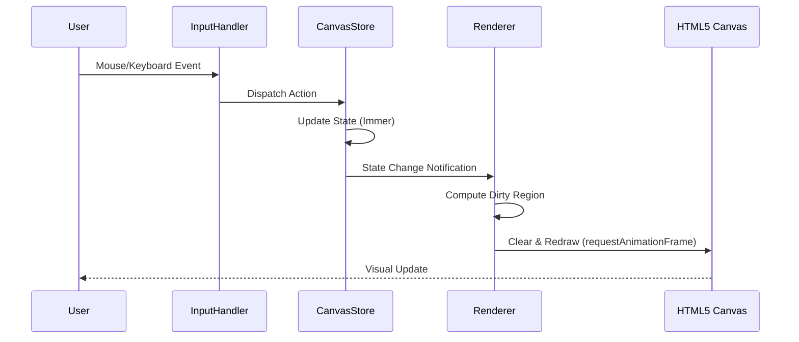
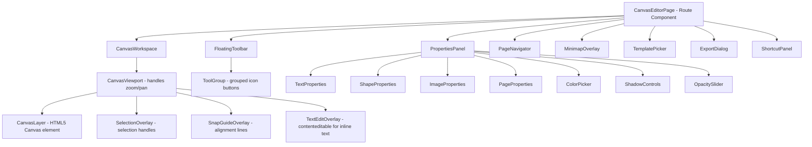
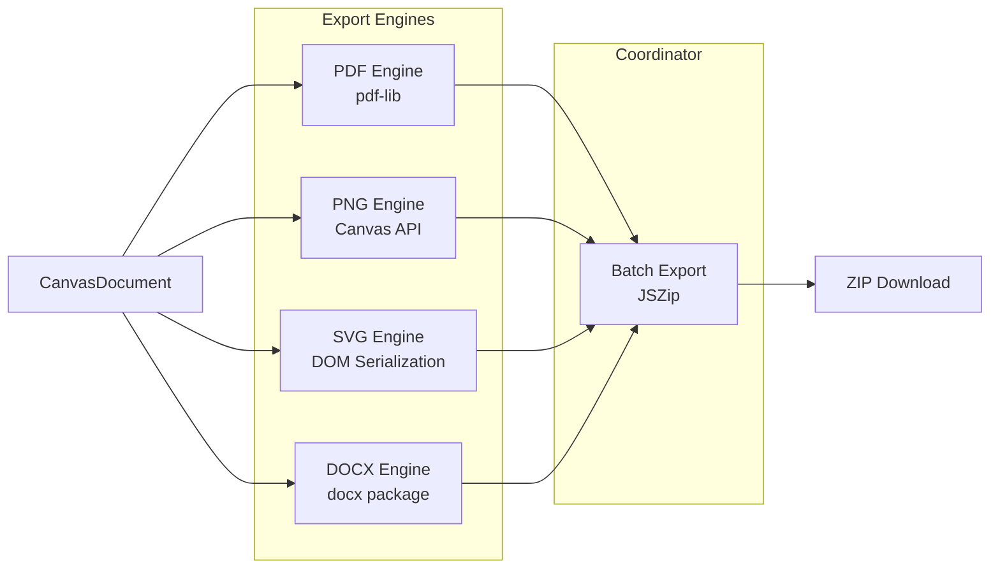
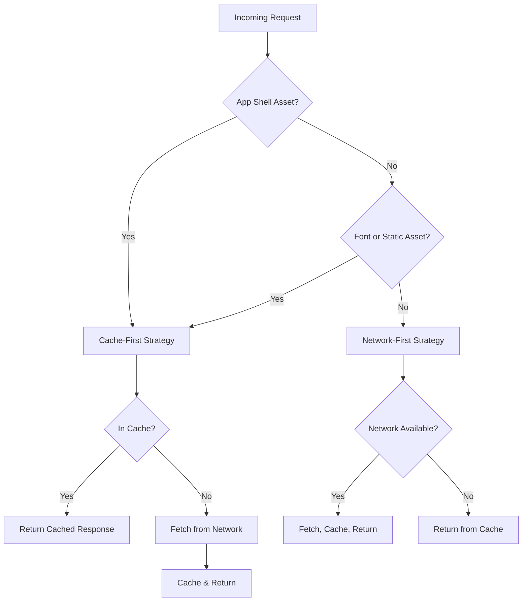
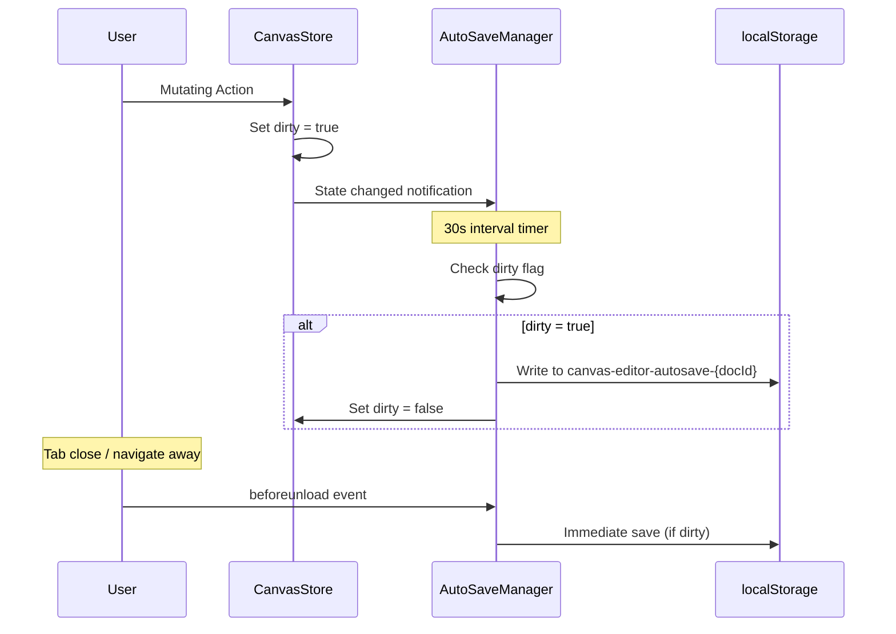

# Design Document: Visual Canvas Editor

## Overview

The Visual Canvas Editor is a Canva/Figma-style design surface integrated into the existing PDF Editor application. It provides a full-featured vector and raster composition environment where users create multi-page documents with text, images, shapes, and effects, then export to PDF, PNG, SVG, or DOCX — all client-side.

### Key Design Decisions

1. **Rendering Approach: HTML5 Canvas (2D Context)** — Chosen over SVG-DOM for performance with 500+ elements per page and over WebGL for simplicity. The Canvas API provides hardware-accelerated 2D rendering, efficient hit-testing via `getImageData`, and straightforward export to PNG/PDF. An off-screen canvas handles export rendering without blocking the UI.

2. **State Management: Zustand with Immer middleware** — Aligns with the existing app pattern. A dedicated `canvasStore` manages the document tree with built-in undo/redo via snapshot-based history (not command pattern), keeping the implementation simple and debuggable.

3. **Export Architecture: Format-specific engines** — Each export format (PDF, PNG, SVG, DOCX) has a dedicated engine module. PDF export uses the existing `pdf-lib` dependency. PNG uses the native Canvas API. SVG is generated via DOM serialization. DOCX uses `docx` (npm package) for Open XML generation.

4. **No new heavy dependencies** — Leverages existing `pdf-lib`, `jszip`, and `zustand`. Only adds `docx` for DOCX export. No external canvas libraries (Fabric.js, Konva) to keep bundle size controlled and maintain full ownership of the rendering pipeline.

## Architecture

### High-Level Architecture Diagram

```mermaid
graph TB
    subgraph UI Layer
        Toolbar[Floating Toolbar]
        PropsPanel[Properties Panel]
        LayersPanel[Layers Panel]
        Minimap[Minimap]
        PageNav[Page Navigator]
    end

    subgraph Canvas Engine
        Renderer[Canvas Renderer]
        HitTest[Hit Test Engine]
        SnapEngine[Snap & Alignment Engine]
        SelectionMgr[Selection Manager]
        InputHandler[Input Handler]
    end

    subgraph State Layer
        CanvasStore[Canvas Store - Zustand]
        HistoryMgr[History Manager]
        Clipboard[Clipboard Manager]
    end

    subgraph Export Layer
        PDFExport[PDF Export Engine]
        PNGExport[PNG Export Engine]
        SVGExport[SVG Export Engine]
        DOCXExport[DOCX Export Engine]
        BatchExport[Batch Export Coordinator]
    end

    subgraph Integration
        Router[React Router]
        NavSidebar[Navigation Sidebar]
        PDFPipeline[PDF Pipeline - pdf-lib]
    end

    UI Layer --> Canvas Engine
    Canvas Engine --> State Layer
    State Layer --> Export Layer
    Integration --> UI Layer
    Export Layer --> PDFPipeline
```

### Rendering Pipeline



The renderer uses `requestAnimationFrame` for all visual updates, batching multiple state changes within a single frame. During drag operations, the renderer only redraws the affected element and its bounding region (dirty-rect optimization) to maintain 60fps.

### Canvas Coordinate System

- **Document coordinates**: Millimeters from page top-left origin (0,0). All element positions are stored in document space.
- **Screen coordinates**: Pixels on the HTML5 Canvas element, derived from document coordinates via the viewport transform: `screenPos = (docPos - panOffset) * zoomLevel`.
- **The viewport transform** is a 2D affine matrix stored in the canvas store, updated on zoom/pan.

## Components and Interfaces

### Component Hierarchy



### Key Component Interfaces

```typescript
// CanvasWorkspace - the main canvas container
interface CanvasWorkspaceProps {
  documentId: string;
}

// FloatingToolbar - tool selection
interface FloatingToolbarProps {
  activeTool: CanvasTool;
  onToolChange: (tool: CanvasTool) => void;
}

// PropertiesPanel - contextual element properties
interface PropertiesPanelProps {
  selectedElements: CanvasElement[];
  onPropertyChange: (elementId: string, updates: Partial<CanvasElement>) => void;
}

// ExportDialog - export format selection and options
interface ExportDialogProps {
  document: CanvasDocument;
  onExport: (options: ExportOptions) => void;
  onClose: () => void;
}

// TemplatePicker - template selection modal
interface TemplatePickerProps {
  onSelect: (templateId: string) => void;
  onClose: () => void;
}
```

### Canvas Engine Modules

```typescript
// src/features/canvas-editor/engine/renderer.ts
interface CanvasRenderer {
  render(state: RenderState): void;
  renderElement(ctx: CanvasRenderingContext2D, element: CanvasElement, viewport: Viewport): void;
  invalidate(region?: BoundingBox): void;
}

// src/features/canvas-editor/engine/hit-test.ts
interface HitTestEngine {
  hitTest(point: Point, elements: CanvasElement[], viewport: Viewport): CanvasElement | null;
  hitTestHandle(point: Point, selection: SelectionState): ResizeHandle | RotateHandle | null;
  getElementsInRect(rect: Rect, elements: CanvasElement[]): CanvasElement[];
}

// src/features/canvas-editor/engine/snap.ts
interface SnapEngine {
  calculateSnap(
    position: Point,
    size: Size,
    elements: CanvasElement[],
    gridSpacing: number,
    enabled: boolean,
  ): SnapResult;
  getSnapGuides(position: Point, size: Size, elements: CanvasElement[]): SnapGuide[];
}

// src/features/canvas-editor/engine/input-handler.ts
interface InputHandler {
  onPointerDown(event: PointerEvent): void;
  onPointerMove(event: PointerEvent): void;
  onPointerUp(event: PointerEvent): void;
  onWheel(event: WheelEvent): void;
  onKeyDown(event: KeyboardEvent): void;
  onKeyUp(event: KeyboardEvent): void;
}
```

### File Structure

```
src/features/canvas-editor/
├── components/
│   ├── CanvasEditorPage.tsx          # Route-level page component
│   ├── CanvasWorkspace.tsx           # Main canvas container
│   ├── CanvasViewport.tsx            # Zoom/pan viewport wrapper
│   ├── FloatingToolbar.tsx           # Top floating toolbar
│   ├── PropertiesPanel.tsx           # Right-side contextual panel
│   ├── PageNavigator.tsx             # Page thumbnails sidebar
│   ├── MinimapOverlay.tsx            # Bottom-right minimap
│   ├── TemplatePicker.tsx            # Template selection modal
│   ├── ExportDialog.tsx              # Export options dialog
│   ├── ShortcutPanel.tsx             # Keyboard shortcut reference
│   ├── TextEditOverlay.tsx           # Inline text editing overlay
│   ├── SelectionOverlay.tsx          # Selection handles/bounds
│   ├── SnapGuideOverlay.tsx          # Snap guide lines
│   ├── EmptyState.tsx                # Empty canvas prompt
│   └── properties/
│       ├── TextProperties.tsx
│       ├── ShapeProperties.tsx
│       ├── ImageProperties.tsx
│       ├── PageProperties.tsx
│       ├── ColorPicker.tsx
│       ├── ShadowControls.tsx
│       └── OpacitySlider.tsx
├── engine/
│   ├── renderer.ts                   # Canvas 2D rendering logic
│   ├── hit-test.ts                   # Point-in-element detection
│   ├── snap.ts                       # Snap-to-grid and smart alignment
│   ├── transform.ts                  # Viewport transform math
│   ├── geometry.ts                   # Geometric utilities
│   └── text-layout.ts               # Text measurement and wrapping
├── export/
│   ├── pdf-export.ts                 # PDF generation via pdf-lib
│   ├── png-export.ts                 # PNG rasterization via Canvas API
│   ├── svg-export.ts                 # SVG serialization
│   ├── docx-export.ts               # DOCX generation via docx package
│   └── batch-export.ts              # Batch export coordinator with JSZip
├── store/
│   ├── canvas-store.ts               # Main Zustand store
│   ├── history.ts                    # Undo/redo history manager
│   └── clipboard.ts                  # Copy/paste state
├── templates/
│   ├── index.ts                      # Template registry
│   ├── blank.ts
│   ├── invoice.ts
│   ├── resume.ts
│   ├── letter.ts
│   └── presentation.ts
├── types.ts                          # All canvas-editor types
├── constants.ts                      # Magic numbers, limits, defaults
└── hooks/
    ├── useCanvasInput.ts             # Pointer/keyboard event handling
    ├── useCanvasRenderer.ts          # Canvas rendering loop
    ├── useCanvasShortcuts.ts         # Keyboard shortcut bindings
    └── useAutoSave.ts                # localStorage persistence
```

## Data Models

### Core Types

```typescript
// === Document Structure ===

interface CanvasDocument {
  id: string;
  name: string;
  pages: CanvasPage[];
  activePageIndex: number;
  createdAt: number;
  updatedAt: number;
}

interface CanvasPage {
  id: string;
  width: number; // in mm (10-5000)
  height: number; // in mm (10-5000)
  backgroundColor: string; // hex color, default '#FFFFFF'
  elements: CanvasElement[];
}

// === Element Types (Discriminated Union) ===

type CanvasElement = TextElement | ImageElement | ShapeElement | GroupElement;

interface BaseElement {
  id: string;
  type: ElementType;
  x: number; // mm from page left
  y: number; // mm from page top
  width: number; // mm
  height: number; // mm
  rotation: number; // degrees (0-359)
  opacity: number; // 0-100
  zIndex: number;
  locked: boolean;
  visible: boolean;
  shadow?: ShadowConfig;
}

type ElementType = 'text' | 'image' | 'shape' | 'group';

// === Text Element ===

interface TextElement extends BaseElement {
  type: 'text';
  content: string; // up to 10,000 characters
  fontFamily: string;
  fontSize: number; // 8-144 pt
  fontColor: string; // hex
  bold: boolean;
  italic: boolean;
  underline: boolean;
  alignment: TextAlignment;
  // Rich text: array of styled runs for mixed formatting
  runs?: TextRun[];
}

interface TextRun {
  start: number; // character offset
  end: number;
  bold?: boolean;
  italic?: boolean;
  underline?: boolean;
  fontColor?: string;
  fontSize?: number;
  fontFamily?: string;
}

type TextAlignment = 'left' | 'center' | 'right' | 'justify';

// === Image Element ===

interface ImageElement extends BaseElement {
  type: 'image';
  src: string; // object URL or data URI
  originalWidth: number; // original image px width
  originalHeight: number; // original image px height
  aspectRatioLocked: boolean;
  cropRect?: CropRect; // visible sub-region (normalized 0-1)
}

interface CropRect {
  x: number; // 0-1 normalized
  y: number;
  width: number;
  height: number;
}

// === Shape Element ===

interface ShapeElement extends BaseElement {
  type: 'shape';
  shapeType: ShapeType;
  fill: string; // hex or 'transparent'
  stroke: string; // hex
  strokeWidth: number; // 0-50 px
  borderStyle: BorderStyle;
  polygonSides?: number; // 3-12, only for polygon type
}

type ShapeType = 'rectangle' | 'circle' | 'line' | 'arrow' | 'star' | 'polygon';
type BorderStyle = 'solid' | 'dashed' | 'dotted';

// === Group Element ===

interface GroupElement extends BaseElement {
  type: 'group';
  children: CanvasElement[]; // minimum 2 elements
}

// === Styling ===

interface ShadowConfig {
  offsetX: number; // -50 to 50 px
  offsetY: number; // -50 to 50 px
  blur: number; // 0 to 100 px
  color: string; // hex with alpha (8-char hex)
}

// === Viewport ===

interface Viewport {
  panX: number; // document-space offset
  panY: number;
  zoom: number; // 0.1 to 4.0 (10% to 400%)
}

// === Tools ===

type CanvasTool =
  | 'select'
  | 'text'
  | 'rectangle'
  | 'circle'
  | 'line'
  | 'arrow'
  | 'star'
  | 'polygon'
  | 'image'
  | 'crop'
  | 'pan';

// === Selection State ===

interface SelectionState {
  selectedIds: string[];
  selectionBounds: BoundingBox | null;
  activeHandle: ResizeHandle | RotateHandle | null;
}

interface BoundingBox {
  x: number;
  y: number;
  width: number;
  height: number;
}

type ResizeHandle = 'nw' | 'n' | 'ne' | 'e' | 'se' | 's' | 'sw' | 'w';
type RotateHandle = 'rotate';

// === Snap ===

interface SnapResult {
  snappedX: number;
  snappedY: number;
  guides: SnapGuide[];
}

interface SnapGuide {
  type: 'horizontal' | 'vertical';
  position: number; // in document coordinates
  sourceId: string; // element that caused the snap
}

// === Export ===

interface ExportOptions {
  format: 'pdf' | 'png' | 'svg' | 'docx';
  pages: 'all' | number[]; // page indices
  dpi?: 72 | 150 | 300; // PNG only
  batch: boolean;
}

interface ExportProgress {
  status: 'idle' | 'exporting' | 'complete' | 'error';
  currentPage: number;
  totalPages: number;
  error?: string;
}

// === Templates ===

interface CanvasTemplate {
  id: string;
  name: string;
  category: TemplateCategory;
  thumbnail: string; // base64 or URL to preview image
  pages: CanvasPage[];
}

type TemplateCategory = 'blank' | 'invoice' | 'resume' | 'letter' | 'presentation';
```

### State Management (Canvas Store)

The canvas store is the single source of truth for all document state. It uses Zustand with Immer for immutable updates and integrates a snapshot-based history system.

```typescript
interface CanvasStoreState {
  // Document
  document: CanvasDocument | null;

  // Viewport
  viewport: Viewport;

  // Selection
  selection: SelectionState;

  // Active tool
  activeTool: CanvasTool;

  // Grid & Snap
  gridEnabled: boolean;
  gridSpacing: number; // 5-100 px
  snapEnabled: boolean;

  // History
  history: HistoryState;

  // Clipboard
  clipboard: CanvasElement[];

  // Color palette
  savedColors: string[]; // up to 32 hex colors

  // Export
  exportProgress: ExportProgress;
}

interface CanvasStoreActions {
  // Document
  createDocument(template?: CanvasTemplate): void;
  loadDocument(doc: CanvasDocument): void;
  saveToLocalStorage(): void;

  // Pages
  addPage(afterIndex?: number): void;
  removePage(pageIndex: number): void;
  setActivePage(pageIndex: number): void;
  setPageSize(pageIndex: number, width: number, height: number): void;

  // Elements
  addElement(element: CanvasElement): void;
  updateElement(id: string, updates: Partial<CanvasElement>): void;
  removeElements(ids: string[]): void;
  duplicateElements(ids: string[]): void;

  // Selection
  select(ids: string[]): void;
  selectAll(): void;
  deselect(): void;

  // Transform
  moveElements(ids: string[], deltaX: number, deltaY: number): void;
  resizeElement(id: string, width: number, height: number, anchor: ResizeHandle): void;
  rotateElement(id: string, angle: number): void;

  // Z-Order
  bringToFront(id: string): void;
  sendToBack(id: string): void;
  moveLayerUp(id: string): void;
  moveLayerDown(id: string): void;

  // Grouping
  groupElements(ids: string[]): void;
  ungroupElement(groupId: string): void;

  // Lock/Visibility
  lockElement(id: string): void;
  unlockElement(id: string): void;
  hideElement(id: string): void;
  showElement(id: string): void;

  // Viewport
  setZoom(zoom: number): void;
  zoomBy(delta: number): void;
  pan(deltaX: number, deltaY: number): void;

  // History
  undo(): void;
  redo(): void;

  // Clipboard
  copy(): void;
  paste(): void;

  // Tools
  setActiveTool(tool: CanvasTool): void;

  // Colors
  saveColor(hex: string): void;
}
```

### History System Design

The history system uses **structural snapshots** of the document state rather than a command pattern. This simplifies implementation and guarantees correctness (no inverse-command bugs).

```typescript
interface HistoryState {
  undoStack: DocumentSnapshot[]; // max 50 entries
  redoStack: DocumentSnapshot[];
  canUndo: boolean;
  canRedo: boolean;
}

interface DocumentSnapshot {
  document: CanvasDocument; // deep clone via structuredClone
  timestamp: number;
  description: string; // human-readable action name
}
```

**History rules:**

- Every mutating action pushes a snapshot of the _previous_ state onto the undo stack
- Undo pops from undo stack, pushes current state to redo stack, restores popped state
- Redo pops from redo stack, pushes current state to undo stack, restores popped state
- Any new action after undo clears the redo stack entirely
- When undo stack exceeds 50 entries, the oldest entry is discarded (FIFO eviction)
- Non-mutating actions (selection, zoom, pan, tool switch) do NOT create history entries

### Export Engine Architecture



Each export engine implements a common interface:

```typescript
interface ExportEngine<TOptions = unknown> {
  exportPage(page: CanvasPage, options: TOptions): Promise<Blob>;
  exportDocument(document: CanvasDocument, options: TOptions): Promise<Blob>;
}
```

**PDF Export** (`pdf-lib`):

- Creates a `PDFDocument`, adds pages with matching dimensions
- Text elements → `page.drawText()` with embedded fonts (vector)
- Shapes → `page.drawRectangle()`, `page.drawEllipse()`, `page.drawLine()`, custom paths
- Images → `pdfDoc.embedPng()`/`embedJpg()` at original resolution
- Applies opacity via graphics state

**PNG Export** (Canvas API):

- Creates an off-screen `OffscreenCanvas` at target DPI resolution
- Pixel dimensions = `(pageMm / 25.4) * dpi`
- Renders all visible elements using the same renderer as the viewport
- Exports via `canvas.convertToBlob({ type: 'image/png' })`

**SVG Export** (DOM serialization):

- Builds an SVG DOM tree programmatically
- Text → `<text>` with font attributes
- Shapes → `<rect>`, `<circle>`, `<line>`, `<polygon>`, `<path>`
- Images → `<image>` with base64 `href`
- Serializes via `XMLSerializer`

**DOCX Export** (`docx` npm package):

- Text elements → `Paragraph` with `TextRun` preserving formatting
- Images → `ImageRun` with original resolution bytes
- Shapes that can't be natively represented → rasterized at 150 DPI via off-screen canvas, embedded as images
- Page dimensions set via `SectionProperties`

**Batch Export** (`jszip`):

- Iterates pages, calls the selected format engine per page
- Wraps results in a ZIP with naming pattern `{name}-page-{NNN}.{ext}`
- Continues on per-page failure, reports summary
- ZIP named `{document-name}-batch.zip`

### Key Algorithms

#### Hit Testing

Hit testing determines which element the user clicked. The algorithm processes elements in reverse z-order (front to back) and returns the first hit.

```typescript
function hitTest(
  point: Point,
  elements: CanvasElement[],
  viewport: Viewport,
): CanvasElement | null {
  // Convert screen point to document coordinates
  const docPoint = screenToDocument(point, viewport);

  // Sort elements by z-index descending (front first)
  const sorted = [...elements].sort((a, b) => b.zIndex - a.zIndex);

  for (const element of sorted) {
    if (!element.visible || element.locked) continue;

    // Apply inverse rotation transform to test point
    const localPoint = transformToLocal(docPoint, element);

    // Axis-aligned bounding box test in local space
    if (
      localPoint.x >= 0 &&
      localPoint.x <= element.width &&
      localPoint.y >= 0 &&
      localPoint.y <= element.height
    ) {
      // For shapes: additional path-based test
      if (element.type === 'shape') {
        if (isPointInShape(localPoint, element)) return element;
      } else {
        return element;
      }
    }
  }
  return null;
}
```

#### Snap-to-Grid Algorithm

```typescript
function calculateSnap(
  position: Point,
  size: Size,
  otherElements: CanvasElement[],
  gridSpacing: number,
  snapEnabled: boolean,
): SnapResult {
  if (!snapEnabled) {
    return { snappedX: position.x, snappedY: position.y, guides: [] };
  }

  const THRESHOLD = 5; // px
  const guides: SnapGuide[] = [];
  let snappedX = position.x;
  let snappedY = position.y;

  // Grid snapping
  const nearestGridX = Math.round(position.x / gridSpacing) * gridSpacing;
  const nearestGridY = Math.round(position.y / gridSpacing) * gridSpacing;

  if (Math.abs(position.x - nearestGridX) <= THRESHOLD) {
    snappedX = nearestGridX;
  }
  if (Math.abs(position.y - nearestGridY) <= THRESHOLD) {
    snappedY = nearestGridY;
  }

  // Smart alignment with other elements
  const edges = getElementEdges(position, size);
  for (const other of otherElements) {
    const otherEdges = getElementEdges(
      { x: other.x, y: other.y },
      { width: other.width, height: other.height },
    );

    // Check horizontal alignments (left, center, right)
    for (const [edge, otherEdge, type] of alignmentPairs(edges, otherEdges)) {
      if (Math.abs(edge - otherEdge) <= THRESHOLD) {
        snappedX = position.x + (otherEdge - edge);
        guides.push({ type: 'vertical', position: otherEdge, sourceId: other.id });
      }
    }
    // Similar for vertical alignments
  }

  return { snappedX, snappedY, guides };
}
```

#### Z-Order Management

Z-indices are maintained as integers. Operations:

```typescript
function bringToFront(elements: CanvasElement[], targetId: string): CanvasElement[] {
  const maxZ = Math.max(...elements.map((e) => e.zIndex));
  return elements.map((e) => (e.id === targetId ? { ...e, zIndex: maxZ + 1 } : e));
}

function sendToBack(elements: CanvasElement[], targetId: string): CanvasElement[] {
  const minZ = Math.min(...elements.map((e) => e.zIndex));
  return elements.map((e) => (e.id === targetId ? { ...e, zIndex: minZ - 1 } : e));
}

function moveLayerUp(elements: CanvasElement[], targetId: string): CanvasElement[] {
  const sorted = [...elements].sort((a, b) => a.zIndex - b.zIndex);
  const idx = sorted.findIndex((e) => e.id === targetId);
  if (idx >= sorted.length - 1) return elements; // already at top

  // Swap z-indices with the element above
  const target = sorted[idx];
  const above = sorted[idx + 1];
  return elements.map((e) => {
    if (e.id === target.id) return { ...e, zIndex: above.zIndex };
    if (e.id === above.id) return { ...e, zIndex: target.zIndex };
    return e;
  });
}
```

#### Rotation Snap (Shift-constrained)

```typescript
function snapRotation(angle: number, shiftHeld: boolean): number {
  if (!shiftHeld) return angle % 360;
  const increment = 15;
  return (Math.round(angle / increment) * increment) % 360;
}
```

#### Aspect-Ratio-Locked Resize

```typescript
function resizeWithAspectLock(
  original: Size,
  dragDelta: Point,
  handle: ResizeHandle,
  locked: boolean,
): Size {
  if (!locked) {
    // Free resize: apply delta directly based on handle
    return applyFreeDelta(original, dragDelta, handle);
  }

  const aspectRatio = original.width / original.height;
  // Use the dominant axis (larger delta) to determine new size
  const newWidth = original.width + dragDelta.x;
  const newHeight = newWidth / aspectRatio;
  return { width: Math.max(1, newWidth), height: Math.max(1, newHeight) };
}
```

#### Image Placement (Center & Fit)

```typescript
function calculateImagePlacement(
  imageSize: Size,
  viewportSize: Size,
  viewport: Viewport,
): { x: number; y: number; width: number; height: number } {
  // Scale to fit within viewport while maintaining aspect ratio
  const scale = Math.min(
    (viewportSize.width * 0.8) / imageSize.width,
    (viewportSize.height * 0.8) / imageSize.height,
    1, // never upscale
  );

  const width = imageSize.width * scale;
  const height = imageSize.height * scale;

  // Center in visible viewport area (convert to document coords)
  const centerX = viewport.panX + viewportSize.width / viewport.zoom / 2;
  const centerY = viewport.panY + viewportSize.height / viewport.zoom / 2;

  return {
    x: centerX - width / 2,
    y: centerY - height / 2,
    width,
    height,
  };
}
```

### Integration Points

#### Navigation Sidebar

A new `design` category is added to `src/features/navigation/categories.ts`:

```typescript
{
  id: 'design',
  label: 'Design',
  tools: [
    { path: '/canvas-editor', label: 'Canvas Editor', categoryId: 'design' },
  ],
}
```

This category is appended after the existing `ocr` category.

#### React Router

A new route is added to `src/app/router.tsx`:

```typescript
<Route path="/canvas-editor" element={<CanvasEditorPage />} />
```

The `CanvasEditorPage` component renders within the existing `Layout` component (sidebar + content area), but uses a full-width content area without the standard padding to maximize canvas space.

#### PDF Pipeline Integration

The "Insert into PDF" export option:

1. Renders the current page as a PDF page blob using `pdf-lib`
2. Navigates to `/merge` with the rendered PDF pre-loaded as a file in the merge tool's state
3. Uses the existing `useMergeStore` or passes the file via a shared temporary store

The "Open PDF page in canvas" flow:

1. Renders the PDF page to a canvas using `pdfjs-dist` (already a dependency)
2. Converts the rendered canvas to a PNG data URL
3. Creates an `ImageElement` with `locked: true` as the background layer (z-index 0)

#### localStorage Persistence

Documents are saved to `localStorage` under the key `canvas-editor-document-{id}`. The auto-save hook triggers on every history-creating action with a 2-second debounce. Manual save (Ctrl+S) is immediate.

Saved colors persist under `canvas-editor-palette`.

## Correctness Properties

_A property is a characteristic or behavior that should hold true across all valid executions of a system — essentially, a formal statement about what the system should do. Properties serve as the bridge between human-readable specifications and machine-verifiable correctness guarantees._

### Property 1: Page dimension validation

_For any_ numeric value V, setting a page dimension to V SHALL succeed if and only if 10 ≤ V ≤ 5000. Values outside this range SHALL be rejected, and the page dimensions SHALL remain unchanged.

**Validates: Requirements 1.2, 1.3**

### Property 2: Zoom level clamping

_For any_ zoom operation that would produce a zoom level Z, the resulting zoom SHALL be clamped to the range [0.10, 4.00]. The stored zoom value SHALL never be less than 0.10 or greater than 4.00.

**Validates: Requirements 1.4**

### Property 3: Zoom increment quantization

_For any_ scroll-wheel or pinch zoom event, the resulting zoom level SHALL be a multiple of 0.05 (5%). That is, `zoom % 0.05 === 0` always holds after a zoom gesture.

**Validates: Requirements 1.5**

### Property 4: Pan preserves element positions

_For any_ set of elements on a page and any pan operation (deltaX, deltaY), all element positions (x, y) SHALL remain identical before and after the pan. Only the viewport offset changes.

**Validates: Requirements 1.6**

### Property 5: Page insertion correctness

_For any_ document with N pages (N < 100) and active page index I, adding a new page SHALL result in N+1 total pages, with the new page at index I+1, and all existing pages preserving their content and order.

**Validates: Requirements 1.7**

### Property 6: Text element creation at position

_For any_ valid canvas coordinate (x, y) within page bounds, activating the text tool and clicking at (x, y) SHALL create a TextElement with position equal to (x, y), width of 200px equivalent in document units, and content "Type here".

**Validates: Requirements 2.1**

### Property 7: Text formatting round-trip

_For any_ valid text formatting configuration (font size in [8, 144], any hex color, any combination of bold/italic/underline, any alignment), applying the formatting to a text element and then reading back the element's properties SHALL return the exact same formatting values.

**Validates: Requirements 2.3, 2.4, 2.5, 2.6, 2.7, 2.8**

### Property 8: Element repositioning

_For any_ element at position (x, y) and any drag delta (dx, dy), after a move operation the element's position SHALL be (x + dx, y + dy), provided the result is within page bounds.

**Validates: Requirements 2.9, 3.4**

### Property 9: Image placement centering and aspect ratio

_For any_ image with dimensions (W, H) placed into a viewport of size (VW, VH), the placed image SHALL maintain its original aspect ratio (W/H), be scaled to fit within 80% of the viewport, and be centered within the visible viewport area.

**Validates: Requirements 3.1**

### Property 10: Aspect-ratio-locked resize preserves ratio

_For any_ image element with aspect ratio lock enabled and original dimensions (W, H), after any resize operation the ratio width/height SHALL equal W/H (within floating-point tolerance of 0.001).

**Validates: Requirements 3.4**

### Property 11: Rotation snap to 15-degree increments

_For any_ rotation angle A applied with Shift held, the resulting rotation SHALL equal `round(A / 15) * 15`, producing values in the set {0, 15, 30, ..., 345}.

**Validates: Requirements 3.8**

### Property 12: Shape dimensions from drag

_For any_ drag operation from point P1 to point P2, the created shape SHALL have width equal to |P2.x - P1.x| and height equal to |P2.y - P1.y|, with position at min(P1, P2) per axis.

**Validates: Requirements 4.1**

### Property 13: Shift-constrained shapes produce squares/circles

_For any_ drag operation with Shift held, the resulting rectangle SHALL have width equal to height (square), and the resulting ellipse SHALL have width equal to height (circle). The constrained dimension SHALL equal the minimum of the drag width and drag height.

**Validates: Requirements 4.2, 4.3**

### Property 14: Shape styling storage

_For any_ valid shape styling (fill as hex or 'transparent', stroke as hex, strokeWidth in [0, 50]), applying the style to a shape element and reading it back SHALL return identical values.

**Validates: Requirements 4.4**

### Property 15: Polygon side count clamping

_For any_ integer N, setting polygon sides SHALL produce `clamp(N, 3, 12)`. Values below 3 become 3, values above 12 become 12, values in [3, 12] are unchanged.

**Validates: Requirements 4.5, 4.6**

### Property 16: Z-order rendering invariant

_For any_ set of visible elements on a page, the render order SHALL be strictly ascending by z-index. That is, for any two elements A and B where A.zIndex < B.zIndex, A is rendered before (behind) B.

**Validates: Requirements 5.1**

### Property 17: Z-order extremes

_For any_ element E in a page with N elements, after `bringToFront(E)`, E.zIndex SHALL be strictly greater than all other elements' z-indices. After `sendToBack(E)`, E.zIndex SHALL be strictly less than all other elements' z-indices.

**Validates: Requirements 5.2, 5.3**

### Property 18: Z-order layer swap

_For any_ element E that is not at the top of the z-order, `moveLayerUp(E)` SHALL swap E's z-index with the element directly above it, and no other elements' z-indices SHALL change. Symmetrically for `moveLayerDown`.

**Validates: Requirements 5.4, 5.5**

### Property 19: Lock prevents all modifications

_For any_ locked element, all mutation operations (move, resize, rotate, edit content, change style) SHALL be rejected and the element's state SHALL remain unchanged.

**Validates: Requirements 5.6**

### Property 20: Hide excludes from render but preserves data

_For any_ hidden element, the element SHALL NOT appear in the list of visible elements (used for rendering and export), but SHALL remain in the page's element array with all properties intact. Showing the element again SHALL restore it to the visible set with unchanged properties.

**Validates: Requirements 5.7**

### Property 21: Group/ungroup round-trip preserves positions

_For any_ set of elements with absolute positions, grouping them and then immediately ungrouping SHALL produce elements with the same absolute positions, dimensions, rotations, and styles as before grouping.

**Validates: Requirements 5.8, 5.9**

### Property 22: Snap-to-grid behavior

_For any_ element position P and grid spacing G with snap enabled, if the distance from P to the nearest grid line is ≤ 5px, the snapped position SHALL equal the nearest grid intersection. If the distance is > 5px, the position SHALL remain unchanged. With snap disabled, the position SHALL always remain unchanged regardless of proximity to grid lines.

**Validates: Requirements 6.1, 6.3**

### Property 23: Undo/redo round-trip

_For any_ sequence of N mutating operations applied to a document, performing N undo operations SHALL restore the document to its initial state. Performing N redo operations after that SHALL restore the document to the state after all N operations.

**Validates: Requirements 7.1, 7.2**

### Property 24: History stack capacity

_For any_ sequence of M mutating operations where M > 50, the undo stack SHALL contain exactly 50 entries (the most recent 50), and the oldest M-50 entries SHALL have been discarded.

**Validates: Requirements 7.3, 7.5**

### Property 25: New action after undo clears redo

_For any_ document state where undo has been performed K times (creating K redo entries), performing a new mutating action SHALL result in an empty redo stack (canRedo = false).

**Validates: Requirements 7.4**

### Property 26: Template independence

_For any_ document created from a template, modifying any element in the document SHALL NOT change any property of the original template. The template's pages and elements SHALL remain identical to their initial state.

**Validates: Requirements 8.4**

### Property 27: DPI-to-pixel dimension calculation

_For any_ page with dimensions (W mm, H mm) and DPI setting D ∈ {72, 150, 300}, the exported PNG pixel dimensions SHALL equal (floor(W/25.4 × D), floor(H/25.4 × D)).

**Validates: Requirements 11.2**

### Property 28: Multi-page export file count

_For any_ document with N pages exported as PNG or SVG, the export SHALL produce exactly N files, one per page.

**Validates: Requirements 11.4, 12.5**

### Property 29: Batch export naming and packaging

_For any_ document with name S and N pages, batch export SHALL produce a ZIP file named "{S}-batch.zip" containing N files named "{S}-page-{NNN}.{ext}" where NNN is the 1-based page number zero-padded to 3 digits.

**Validates: Requirements 14.1, 14.2, 14.3**

### Property 30: Batch export resilience

_For any_ batch export where K out of N pages fail, the resulting ZIP SHALL contain exactly N-K successfully exported files, and the error summary SHALL list exactly K failed page indices.

**Validates: Requirements 14.4**

### Property 31: Select-all selects every element

_For any_ page with N elements (where N ≥ 0), the select-all operation SHALL result in exactly N elements being selected, with selectedIds containing every element's id on the current page.

**Validates: Requirements 17.1**

### Property 32: Duplicate produces offset copy

_For any_ element at position (x, y) with any properties, duplicating it SHALL create a new element with identical properties except: a new unique id, position (x+10, y+10), and the highest z-index on the page.

**Validates: Requirements 17.2, 17.6**

### Property 33: Arrow key movement precision

_For any_ element at position (x, y), pressing an arrow key SHALL move the element by exactly 1px in the arrow direction (or exactly 10px if Shift is held). No other element properties SHALL change.

**Validates: Requirements 17.5**

### Property 34: Save persists document to localStorage

_For any_ document state, after a save operation, reading from localStorage and deserializing SHALL produce a document with identical structure, pages, and elements (deep equality excluding transient fields like selection state).

**Validates: Requirements 17.7**

---

## Product Polish: Requirements 18–23

### Architecture Additions

The following additions extend the existing architecture to support onboarding, recent files, PWA capabilities, auto-save/recovery, performance optimization, and loading states.

```mermaid
graph TB
    subgraph Product Polish Layer
        Onboarding[OnboardingTour]
        RecentFiles[RecentFilesPanel]
        InstallPrompt[InstallPrompt - PWA]
        RecoveryPrompt[RecoveryPrompt]
        SkeletonLayouts[SkeletonLayouts]
    end

    subgraph Service Layer
        SW[Service Worker]
        AutoSave[Auto-Save System]
        OnboardingStore[Onboarding Store]
        RecentFilesStore[Recent Files Store]
    end

    subgraph Existing Layers
        CanvasStore[Canvas Store]
        UI[UI Layer]
        Router[React Router]
    end

    Product Polish Layer --> Service Layer
    Service Layer --> Existing Layers
    SW --> Router
    AutoSave --> CanvasStore
    OnboardingStore --> UI
    RecentFilesStore --> UI
```

### New Components

#### OnboardingTour

A step-by-step guided tour overlay that highlights key UI regions for first-time users.

```typescript
interface OnboardingTourProps {
  onComplete: () => void;
  onSkip: () => void;
  startAtStep?: number;
}

interface OnboardingStep {
  id: string;
  targetSelector: string; // CSS selector for spotlight target
  title: string;
  description: string;
  position: 'top' | 'bottom' | 'left' | 'right';
}
```

**Behavior:**

- Renders a semi-transparent dark overlay (`bg-black/60`) over the entire viewport
- Cuts out a spotlight region around the target element with a `4px` glow border
- Positions a tooltip card adjacent to the spotlight with "Next" and "Skip" buttons
- Supports keyboard navigation: Enter/→ for next, Escape to dismiss
- Steps: Toolbar → Canvas Area → Properties Panel → Export Button → Page Navigator (5 steps)

#### RecentFilesPanel

Displays recent documents as visual cards with thumbnails.

```typescript
interface RecentFilesPanelProps {
  maxDisplay?: number; // default 10
  onFileSelect: (fileId: string) => void;
  onFileDelete: (fileId: string) => void;
}

interface RecentFileEntry {
  id: string;
  name: string;
  lastOpened: number; // Unix timestamp
  type: 'canvas-design' | 'pdf-tool-operation';
  thumbnail: string; // base64, max 10KB
  documentRef: string; // localStorage key for saved data
}
```

#### InstallPrompt

A subtle PWA install banner that appears when the browser supports installation.

```typescript
interface InstallPromptProps {
  onInstall: () => void;
  onDismiss: () => void;
}
```

**Behavior:**

- Listens for `beforeinstallprompt` event, stores the event reference
- Renders as a slim banner in the navigation area (not a modal)
- Shows app icon + "Install PDF Editor for offline use" + Install button
- Dismissible via X button; dismissed state stored in localStorage
- Does not show if app is already in standalone mode (`window.matchMedia('(display-mode: standalone)')`)

#### RecoveryPrompt

A modal dialog that appears when auto-saved data from a previous session is detected.

```typescript
interface RecoveryPromptProps {
  documentName: string;
  lastSavedAt: number; // Unix timestamp
  onRestore: () => void;
  onDiscard: () => void;
}
```

**Behavior:**

- Displays document name and relative time since last auto-save
- "Restore" loads the auto-saved document into the canvas store
- "Discard" deletes the auto-save entry from localStorage and shows fresh canvas
- Appears only when `canvas-editor-autosave-{id}` exists without a corresponding explicit close event

#### SkeletonLayouts

Localized skeleton components that match the editor structure during loading.

```typescript
// Skeleton variants for different loading contexts
interface SkeletonProps {
  variant: 'editor' | 'export-progress' | 'image-upload' | 'template-load';
}
```

**Variants:**

- `editor`: Toolbar skeleton (row of rounded rects) + canvas area (large rect with subtle pulse) + properties panel skeleton (stacked lines)
- `export-progress`: Format icon + "Exporting page X of Y" + determinate progress bar
- `image-upload`: Positioned placeholder at target coords with pulse animation + "Loading image..." text
- `template-load`: Full-size template thumbnail with shimmer overlay (CSS gradient animation)

### New Modules

#### Service Worker (`public/service-worker.ts`)

```typescript
// Caching strategy: Cache-First for app shell, Network-First for dynamic content
interface CacheConfig {
  appShellCache: string; // 'pdf-editor-shell-v{version}'
  dynamicCache: string; // 'pdf-editor-dynamic-v{version}'
  appShellAssets: string[]; // HTML, CSS, JS bundles, fonts, icons
}
```

**Caching Strategy:**



**Lifecycle:**

1. `install`: Pre-cache all app shell assets (HTML, CSS, JS bundles, fonts, manifest, icons)
2. `activate`: Clean up old cache versions, claim all clients
3. `fetch`: Route requests through cache strategy
4. `message`: Handle skip-waiting for updates, trigger refresh toast via `postMessage`

**Update Flow:**

- New SW version detected → installs in background → sends `NEW_VERSION_AVAILABLE` message to all clients
- Client receives message → displays "New version available — Refresh" toast
- User clicks refresh → `skipWaiting()` + `clients.claim()` + page reload

**Tesseract Language Pack Caching:**

- When a user downloads a language pack for OCR, the SW intercepts the response and caches it in a dedicated `pdf-editor-tesseract-v1` cache
- On subsequent offline requests for the same language pack, serves from cache

#### Onboarding Store (`src/features/canvas-editor/store/onboarding-store.ts`)

```typescript
interface OnboardingStoreState {
  isOnboarded: boolean;
  tourActive: boolean;
  currentStep: number;
  totalSteps: number;
}

interface OnboardingStoreActions {
  checkOnboardingStatus(): void; // reads localStorage flag
  startTour(): void;
  nextStep(): void;
  skipTour(): void;
  completeTour(): void;
  resetTour(): void; // for "Show Tour" replay
}
```

**localStorage key:** `canvas-editor-onboarded` (value: `"true"`)

#### Recent Files Store (`src/features/canvas-editor/store/recent-files-store.ts`)

```typescript
interface RecentFilesStoreState {
  recentFiles: RecentFileEntry[];
  isLoading: boolean;
}

interface RecentFilesStoreActions {
  loadRecentFiles(): void; // reads from localStorage
  addRecentFile(entry: Omit<RecentFileEntry, 'id'>): void;
  removeRecentFile(id: string): void;
  openRecentFile(id: string): Promise<void>;
  generateThumbnail(document: CanvasDocument): string; // returns base64
}
```

**localStorage key:** `pdf-editor-recent-files` (value: JSON array of `RecentFileEntry`)

**Capacity management:**

- On `addRecentFile`: if list length ≥ 20, remove the oldest entry (lowest `lastOpened` timestamp) before adding
- Always re-sort by `lastOpened` descending after mutation
- Thumbnail generation: renders page 1 to a 120×160 off-screen canvas, exports as JPEG at quality 0.6, ensures ≤ 10KB via quality reduction loop

### PWA Architecture

#### manifest.json (updated)

```json
{
  "name": "PDF Editor",
  "short_name": "PDF Editor",
  "start_url": "/",
  "display": "standalone",
  "theme_color": "#1a1a2e",
  "background_color": "#ffffff",
  "icons": [
    { "src": "/icons/icon-192.png", "sizes": "192x192", "type": "image/png" },
    { "src": "/icons/icon-512.png", "sizes": "512x512", "type": "image/png" },
    {
      "src": "/icons/icon-512-maskable.png",
      "sizes": "512x512",
      "type": "image/png",
      "purpose": "maskable"
    }
  ],
  "categories": ["productivity", "utilities"],
  "description": "Privacy-first PDF tools and visual design editor. Works offline."
}
```

#### Service Worker Registration (`src/app/sw-register.ts`)

```typescript
async function registerServiceWorker(): Promise<void> {
  if (!('serviceWorker' in navigator)) return;

  const registration = await navigator.serviceWorker.register('/service-worker.js');

  // Listen for updates
  registration.addEventListener('updatefound', () => {
    const newWorker = registration.installing;
    newWorker?.addEventListener('statechange', () => {
      if (newWorker.state === 'activated' && navigator.serviceWorker.controller) {
        // New version available — show toast
        showUpdateToast();
      }
    });
  });
}
```

### Auto-Save System Design



#### Auto-Save Manager (`src/features/canvas-editor/hooks/useAutoSave.ts` — enhanced)

```typescript
interface AutoSaveConfig {
  intervalMs: number; // 30000 (30 seconds)
  storageKeyPrefix: string; // 'canvas-editor-autosave-'
}

interface AutoSaveState {
  isDirty: boolean;
  lastSavedAt: number | null;
  saveError: string | null;
}

// Hook implementation
function useAutoSave(documentId: string, config: AutoSaveConfig): AutoSaveState {
  // 1. Set up 30s interval that checks dirty flag
  // 2. Register beforeunload handler for immediate save
  // 3. On save: serialize document → write to localStorage
  // 4. On quota exceeded: set saveError, show warning toast, continue
  // 5. Key format: `canvas-editor-autosave-${documentId}`
}
```

**Recovery Flow:**

```typescript
function checkForRecovery(documentId: string): RecoveryData | null {
  const key = `canvas-editor-autosave-${documentId}`;
  const data = localStorage.getItem(key);
  if (!data) return null;

  try {
    const parsed = JSON.parse(data) as { document: CanvasDocument; savedAt: number };
    return { document: parsed.document, savedAt: parsed.savedAt };
  } catch {
    // Corrupted data — clean up
    localStorage.removeItem(key);
    return null;
  }
}
```

**Key separation guarantee:**

- Manual saves: `canvas-editor-document-{id}` (existing)
- Auto-saves: `canvas-editor-autosave-{id}` (new, separate namespace)
- Auto-save never reads from or writes to the manual save key

### Performance Strategy

#### Code Splitting and Lazy Loading

```typescript
// src/app/router.tsx — lazy-loaded routes
const CanvasEditorPage = lazy(() => import('../features/canvas-editor/components/CanvasEditorPage'));
const OcrPage = lazy(() => import('../features/ocr/components/OcrPage'));
const ExportEngines = lazy(() => import('../features/canvas-editor/export'));

// Route definition with Suspense
<Route path="/canvas-editor" element={
  <Suspense fallback={<EditorSkeleton />}>
    <CanvasEditorPage />
  </Suspense>
} />
```

**Bundle Strategy:**

- Initial bundle (shared): React, Zustand, Router, Layout, NavBar — target < 200KB gzipped
- Canvas editor chunk: Canvas engine, renderer, tools, properties — loaded on `/canvas-editor` navigation
- Export engines chunk: pdf-lib, docx, jszip — loaded only when user initiates export
- OCR chunk: Tesseract.js wrapper — loaded on OCR route navigation

#### Mobile Canvas Dimension Clamping

```typescript
function calculateCanvasDimensions(
  pageWidth: number,
  pageHeight: number,
  dpr: number,
  isMobile: boolean,
): { width: number; height: number } {
  const MAX_MOBILE_DIMENSION = 4096;

  let width = pageWidth * dpr;
  let height = pageHeight * dpr;

  if (isMobile && (width > MAX_MOBILE_DIMENSION || height > MAX_MOBILE_DIMENSION)) {
    const scale = Math.min(MAX_MOBILE_DIMENSION / width, MAX_MOBILE_DIMENSION / height);
    width = Math.floor(width * scale);
    height = Math.floor(height * scale);
  }

  return { width, height };
}
```

#### GPU Compositing

All animated elements use CSS `will-change: transform` and are promoted to their own compositor layer:

- Toolbar transitions (tool switch highlight)
- Properties panel slide-in/out
- Page transitions in navigator
- Onboarding spotlight animations
- Skeleton pulse/shimmer animations

### Updated File Structure (New Files)

```
src/features/canvas-editor/
├── components/
│   ├── ... (existing components)
│   ├── OnboardingTour.tsx            # Step-by-step guided tour overlay
│   ├── RecentFilesPanel.tsx          # Recent documents grid
│   ├── InstallPrompt.tsx             # PWA install banner
│   ├── RecoveryPrompt.tsx            # Auto-save recovery dialog
│   └── skeletons/
│       ├── EditorSkeleton.tsx        # Full editor layout skeleton
│       ├── ExportProgressSkeleton.tsx # Export progress indicator
│       ├── ImageUploadPlaceholder.tsx # Image loading placeholder
│       └── TemplateLoadSkeleton.tsx  # Template shimmer overlay
├── store/
│   ├── ... (existing stores)
│   ├── onboarding-store.ts           # Onboarding tour state
│   └── recent-files-store.ts         # Recent files management
├── hooks/
│   ├── ... (existing hooks)
│   ├── useAutoSave.ts                # Enhanced with recovery flow
│   ├── useInstallPrompt.ts           # PWA beforeinstallprompt handling
│   └── useLoadingState.ts            # Centralized loading state management
└── ...

src/app/
├── sw-register.ts                    # Service Worker registration logic

public/
├── service-worker.js                 # Compiled Service Worker
├── manifest.json                     # Updated PWA manifest
└── icons/
    ├── icon-192.png
    ├── icon-512.png
    └── icon-512-maskable.png
```

### New Data Models

```typescript
// === Onboarding ===

interface OnboardingStep {
  id: string;
  targetSelector: string;
  title: string;
  description: string;
  position: 'top' | 'bottom' | 'left' | 'right';
}

// === Recent Files ===

interface RecentFileEntry {
  id: string;
  name: string;
  lastOpened: number;
  type: 'canvas-design' | 'pdf-tool-operation';
  thumbnail: string; // base64 JPEG, max 10KB
  documentRef: string; // localStorage key
}

// === Auto-Save ===

interface AutoSaveEntry {
  document: CanvasDocument;
  savedAt: number; // Unix timestamp
  documentId: string;
}

// === Loading States ===

type LoadingContext =
  | { type: 'editor-init' }
  | { type: 'export'; currentPage: number; totalPages: number; format: string }
  | { type: 'image-upload'; targetPosition: Point }
  | { type: 'template-load'; templateId: string; thumbnailSrc: string };

// === PWA ===

interface ServiceWorkerMessage {
  type: 'NEW_VERSION_AVAILABLE' | 'CACHE_UPDATED' | 'SKIP_WAITING';
  payload?: unknown;
}
```

---

## Correctness Properties (Requirements 18–23)

### Property 35: Onboarding completion persists flag

_For any_ onboarding tour interaction where the user either completes all steps or skips at any step N (1 ≤ N ≤ total steps), the localStorage key `canvas-editor-onboarded` SHALL be set to `"true"`, and subsequent checks of onboarding status SHALL return `isOnboarded = true`.

**Validates: Requirements 18.4**

### Property 36: Recent files capacity and ordering invariant

_For any_ sequence of K document-open operations (K ≥ 0), the recent files list SHALL contain at most 20 entries, and the entries SHALL be sorted in strictly descending order by `lastOpened` timestamp (most recent first). When K > 20, only the 20 most recently opened documents are retained.

**Validates: Requirements 19.1, 19.7**

### Property 37: Recent file entry structural completeness

_For any_ document added to the recent files list with name N, timestamp T, type Y, and document reference R, the stored entry SHALL contain all required fields (id, name, lastOpened, type, thumbnail, documentRef) with `name === N`, `lastOpened === T`, `type === Y`, `documentRef === R`, and `thumbnail.length ≤ 10240` (10KB base64).

**Validates: Requirements 19.2**

### Property 38: Recent file deletion correctness

_For any_ recent files list of length N (N ≥ 1) and any valid entry ID in the list, deleting that entry SHALL produce a list of length N-1 that does not contain the deleted ID, and all other entries SHALL remain unchanged in their relative order.

**Validates: Requirements 19.5**

### Property 39: Mobile canvas dimension clamping

_For any_ page dimensions (W, H) in pixels and device pixel ratio DPR on a mobile device, the rendered canvas dimensions SHALL satisfy: `width ≤ 4096` AND `height ≤ 4096`, AND the aspect ratio `width/height` SHALL equal `(W × DPR) / (H × DPR)` within floating-point tolerance of 0.01.

**Validates: Requirements 21.6**

### Property 40: Auto-save triggers only when dirty

_For any_ document state, the auto-save system SHALL write to localStorage if and only if the dirty flag is `true`. When the dirty flag is `false`, no localStorage write SHALL occur during the auto-save interval, and the stored data (if any) SHALL remain unchanged.

**Validates: Requirements 22.1**

### Property 41: Auto-save restore round-trip

_For any_ valid canvas document state D, auto-saving D to localStorage and then restoring it SHALL produce a document D' where `deepEqual(D, D')` holds — all pages, elements, positions, styles, and metadata are preserved.

**Validates: Requirements 22.5**

### Property 42: Auto-save key isolation from manual saves

_For any_ document with ID X, the auto-save key SHALL be `canvas-editor-autosave-${X}` and the manual save key SHALL be `canvas-editor-document-${X}`. Writing to the auto-save key SHALL never modify the value stored at the manual save key, and vice versa.

**Validates: Requirements 22.7**

### Property 43: Export progress text format

_For any_ export operation processing page K of N total pages (1 ≤ K ≤ N, N ≥ 1), the progress indicator text SHALL equal `"Exporting page ${K} of ${N}"` and the progress bar value SHALL equal `K / N` (a value between 0 and 1 inclusive).

**Validates: Requirements 23.2**

---

## Error Handling

### Input Validation Errors

| Scenario                              | Behavior                                                             |
| ------------------------------------- | -------------------------------------------------------------------- |
| Page dimension outside [10, 5000] mm  | Reject input, show inline error message, preserve current dimensions |
| Font size outside [8, 144] pt         | Clamp to nearest valid bound                                         |
| Polygon sides outside [3, 12]         | Clamp to nearest valid bound                                         |
| Stroke width outside [0, 50] px       | Clamp to nearest valid bound                                         |
| Grid spacing outside [5, 100] px      | Clamp to nearest valid bound                                         |
| Image upload > 50MB                   | Reject, show toast with file size limit                              |
| Image upload unsupported format       | Reject, show toast listing supported formats                         |
| Page count at 100, add page attempted | Reject, show toast with max page message                             |
| Text content exceeds 10,000 chars     | Truncate at limit, show inline warning                               |

### Export Errors

| Scenario                                     | Behavior                                                                                           |
| -------------------------------------------- | -------------------------------------------------------------------------------------------------- |
| PDF export memory error                      | Show error toast, no file downloaded, no corrupted partial file                                    |
| PNG export canvas size exceeds browser limit | Show error toast suggesting lower DPI or fewer pages                                               |
| SVG export memory error (large images)       | Show error toast suggesting image size reduction                                                   |
| DOCX export failure                          | Show error toast, no file downloaded                                                               |
| Batch export single page failure             | Continue remaining pages, include successful files in ZIP, show summary toast listing failed pages |

### Runtime Errors

| Scenario                                   | Behavior                                              |
| ------------------------------------------ | ----------------------------------------------------- |
| PDF page render failure (corrupted PDF)    | Show error toast, present empty canvas as fallback    |
| localStorage quota exceeded on save        | Show warning toast, document remains in memory        |
| structuredClone failure (history snapshot) | Skip history entry, log warning, continue operation   |
| Font loading failure                       | Fall back to system font stack, show subtle indicator |

### Onboarding & Recent Files Errors (Requirements 18–19)

| Scenario                                              | Behavior                                                                    |
| ----------------------------------------------------- | --------------------------------------------------------------------------- |
| localStorage unavailable for onboarding flag          | Tour shows every time; degrade gracefully without persistence               |
| Recent file document data corrupted in localStorage   | Remove entry from recent list, show toast "Document could not be recovered" |
| Recent file thumbnail generation fails (canvas error) | Use a generic placeholder icon instead of thumbnail                         |
| localStorage quota exceeded when adding recent file   | Skip adding to recent list, show warning toast, continue operation          |

### PWA & Service Worker Errors (Requirement 20)

| Scenario                                | Behavior                                                                        |
| --------------------------------------- | ------------------------------------------------------------------------------- |
| Service Worker registration fails       | App continues as normal web app without offline support; log warning            |
| Cache storage quota exceeded            | Evict oldest dynamic cache entries; app shell cache is never evicted            |
| Service Worker update fails mid-install | Keep existing SW active, retry on next page load                                |
| Offline with uncached route             | Show offline fallback page with "You're offline" message and cached routes list |

### Auto-Save & Recovery Errors (Requirement 22)

| Scenario                                             | Behavior                                                                                                            |
| ---------------------------------------------------- | ------------------------------------------------------------------------------------------------------------------- |
| localStorage quota exceeded during auto-save         | Show non-blocking warning toast "Auto-save failed — storage full. Consider exporting your work." Continue operating |
| Auto-save data corrupted on recovery attempt         | Remove corrupted entry, show toast "Recovery data was corrupted", present fresh canvas                              |
| beforeunload save fails (browser kills tab too fast) | Accept data loss; recovery will use last successful 30s auto-save                                                   |
| JSON.parse fails on auto-save data                   | Remove key from localStorage, treat as no recovery data available                                                   |

### Performance & Loading Errors (Requirements 21, 23)

| Scenario                                        | Behavior                                                                                              |
| ----------------------------------------------- | ----------------------------------------------------------------------------------------------------- |
| Canvas exceeds mobile memory limit (4096×4096)  | Automatically downscale to fit within limits; show subtle "Reduced quality for performance" indicator |
| Lazy-loaded chunk fails to load (network error) | Show retry button in the skeleton area; "Failed to load. Tap to retry."                               |
| Image upload processing timeout (>10s)          | Show "Taking longer than expected" message below placeholder; continue waiting                        |

## Testing Strategy

### Dual Testing Approach

This feature uses both unit tests and property-based tests for comprehensive coverage:

- **Property-based tests** verify universal correctness properties (43 properties defined above) across randomized inputs using `fast-check` with the `@fast-check/vitest` integration (already in devDependencies).
- **Unit tests** verify specific examples, integration points, edge cases, and error conditions.
- **Integration tests** verify export engine output validity, PDF pipeline integration, and Service Worker behavior.

### Property-Based Testing Configuration

- **Library**: `fast-check` (v4.8.0, already installed) with `@fast-check/vitest` (v0.1.6)
- **Minimum iterations**: 100 per property test
- **Tag format**: `Feature: visual-canvas-editor, Property {N}: {title}`
- Each property test maps to exactly one correctness property from the design document

### Test Organization

```
src/features/canvas-editor/
├── __tests__/
│   ├── properties/
│   │   ├── page-management.property.test.ts    # Properties 1-5
│   │   ├── text-elements.property.test.ts      # Properties 6-8
│   │   ├── image-elements.property.test.ts     # Properties 9-11
│   │   ├── shapes.property.test.ts             # Properties 12-15
│   │   ├── layers.property.test.ts             # Properties 16-21
│   │   ├── snap-alignment.property.test.ts     # Property 22
│   │   ├── history.property.test.ts            # Properties 23-25
│   │   ├── templates.property.test.ts          # Property 26
│   │   ├── export.property.test.ts             # Properties 27-30
│   │   ├── shortcuts.property.test.ts          # Properties 31-34
│   │   ├── onboarding.property.test.ts         # Property 35
│   │   ├── recent-files.property.test.ts       # Properties 36-38
│   │   ├── performance.property.test.ts        # Property 39
│   │   ├── auto-save.property.test.ts          # Properties 40-42
│   │   └── loading-states.property.test.ts     # Property 43
│   ├── unit/
│   │   ├── canvas-store.test.ts
│   │   ├── renderer.test.ts
│   │   ├── hit-test.test.ts
│   │   ├── snap.test.ts
│   │   ├── geometry.test.ts
│   │   ├── text-layout.test.ts
│   │   ├── onboarding-store.test.ts
│   │   ├── recent-files-store.test.ts
│   │   ├── auto-save.test.ts
│   │   ├── install-prompt.test.ts
│   │   └── loading-states.test.ts
│   └── integration/
│       ├── pdf-export.test.ts
│       ├── png-export.test.ts
│       ├── svg-export.test.ts
│       ├── docx-export.test.ts
│       ├── pdf-pipeline.test.ts
│       └── service-worker.test.ts
```

### Unit Test Focus Areas

- **Edge cases**: Empty documents, single element, max elements (500), boundary values
- **Error conditions**: Invalid inputs, export failures, corrupted data, localStorage quota exceeded
- **Integration points**: Navigation registration, route loading, PDF pipeline handoff, Service Worker lifecycle
- **UI interactions**: Tool switching, selection state transitions, keyboard shortcut dispatch
- **Onboarding**: Tour step navigation, skip/complete behavior, replay from help menu
- **Recent files**: Capacity overflow, corrupted entries, thumbnail generation fallback
- **Auto-save**: Dirty flag management, beforeunload save, recovery prompt logic
- **PWA**: Install prompt visibility, standalone mode detection, update toast

### What Is NOT Property-Tested

- UI rendering and visual appearance (Requirements 16.x, 23.x skeleton visuals) — verified via manual testing and visual regression
- Performance requirements (60fps, 100ms response, Lighthouse 90+) — verified via performance benchmarks and Lighthouse CI
- Export format validity (valid PDF/SVG/DOCX structure) — verified via integration tests with format validators
- Service Worker caching behavior — verified via integration tests with mock SW environment
- PWA installation flow — verified via manual testing in supported browsers
- Accessibility compliance — verified via manual testing with assistive technologies
- Onboarding visual spotlight/dimming effects — verified via visual regression tests
